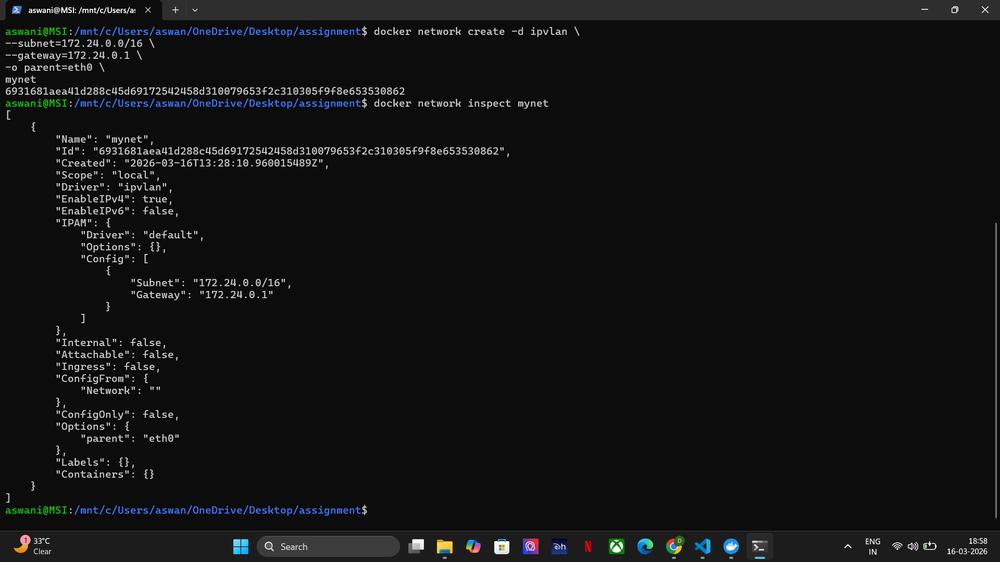
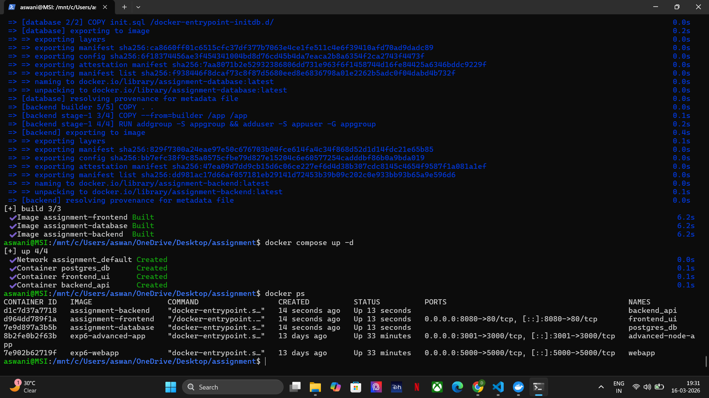
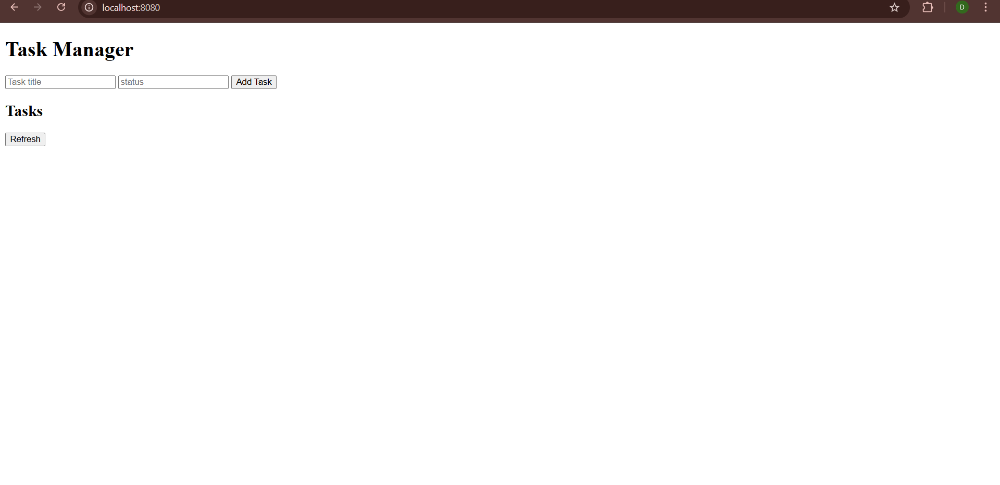
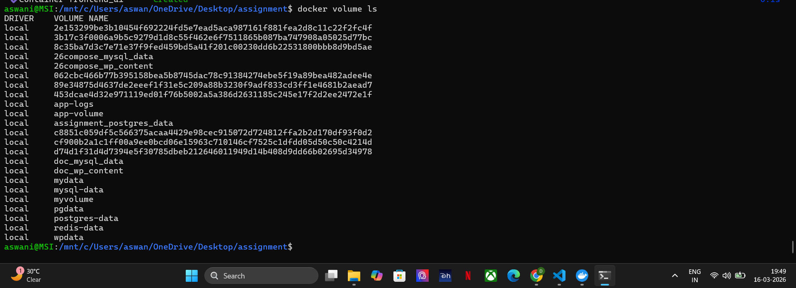
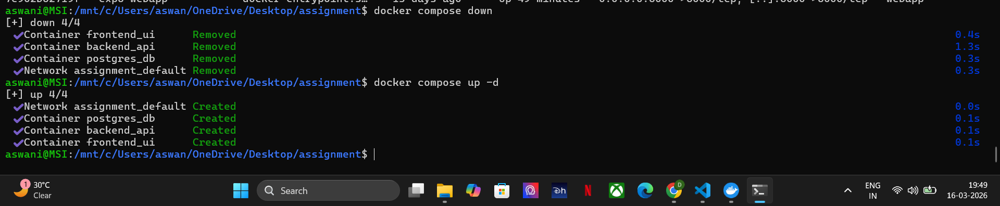
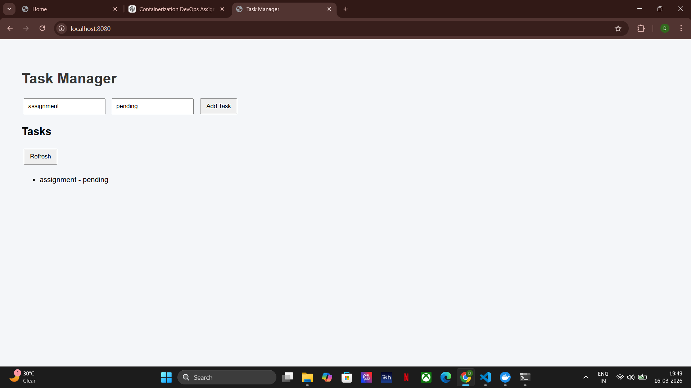
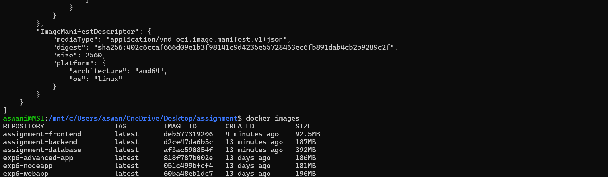

# Containerized Task Manager with PostgreSQL using Docker Compose and IPVLAN

## Overview

This project demonstrates a **containerized full-stack Task Manager application** using Docker.
It includes a **frontend (Nginx), backend API (Node.js + Express), and PostgreSQL database**, orchestrated with **Docker Compose** and connected through an **IPVLAN network**.

The project also demonstrates **Docker image optimization techniques**, comparing:

- Optimized build (Alpine + Multi-stage)
- Non-optimized build (Standard images)

---

## Architecture

```
Client Browser
      │
      ▼
Frontend Container (Nginx) — frontend_ui
localhost:8080
      │
      ▼
Backend API Container (Node.js + Express) — backend_api
      │
      ▼
PostgreSQL Container — postgres_db
```

All services communicate through a custom **IPVLAN network (`mynet`)**.

---

## Project Structure

```
assignment/
│
├── backend/
│   ├── Dockerfile
│   ├── server.js
│   ├── package.json
│   └── .dockerignore
│
├── database/
│   ├── Dockerfile
│   └── init.sql
│
├── frontend/
│   ├── Dockerfile
│   └── index.html
│
└── docker-compose.yml
```

---

## Technology Stack

| Component | Technology |
|---|---|
| Frontend | HTML + Nginx |
| Backend | Node.js + Express |
| Database | PostgreSQL |
| Containerization | Docker |
| Orchestration | Docker Compose |
| Networking | IPVLAN |

---

## Docker Image Optimization

### Optimized Build
- Alpine base images
- Multi-stage builds
- Non-root user
- Minimal layers

### Non-Optimized Build
- Standard images
- Single stage builds
- Larger image sizes

---

## Create Network (Required)

Create IPVLAN network manually:

```bash
docker network create -d ipvlan \
  --subnet=172.24.0.0/16 \
  --gateway=172.24.0.1 \
  -o parent=eth0 \
  mynet
```

Verify:

```bash
docker network inspect mynet
```



---

# docker-compose.yml

Docker Compose orchestrates all services.

Services defined:

* frontend
* backend
* database

Compose configuration includes:

* static IP assignment
* external IPVLAN network
* named volumes
* environment variables
* restart policy


```yaml
services:

  database:
    build: ./database
    container_name: postgres_db
    restart: always
    volumes:
      - postgres_data:/var/lib/postgresql/data
    environment:
      POSTGRES_DB: taskdb
      POSTGRES_USER: appuser
      POSTGRES_PASSWORD: securepassword

  backend:
    build: ./backend
    container_name: backend_api
    restart: always
    depends_on:
      - database
    ports:
      - "5001:5000"
    environment:
      DB_HOST: database
      DB_USER: appuser
      DB_PASSWORD: securepassword
      DB_NAME: taskdb

  frontend:
    build: ./frontend
    container_name: frontend_ui
    restart: always
    ports:
      - "8080:80"
    depends_on:
      - backend

volumes:
  postgres_data:
```

---

## Build and Run the Application

### Build Containers

```bash
docker compose build
```

### Start Containers

```bash
docker compose up -d
```

### Check Running Containers

```bash
docker ps
```



---

## Container Details

| Service | Container Name | Port |
|---|---|---|
| Frontend | frontend_ui | 8080:80 |
| Backend | backend_api | — |
| Database | postgres_db | — |

---

## Application Usage

Open the frontend in a browser:

```
http://localhost:8080
```

The **Task Manager** interface allows users to:

- Add new task records (Task name + Status)
- View stored task records
- Click **Refresh** to fetch latest data from the backend

When the application first loads, the frontend UI is empty with no tasks listed. The input fields accept a task name and status, and the **Add Task** button submits the data to the backend API:



---

## Adding Data Through Frontend

Steps:

1. Open `http://localhost:8080`
2. Enter **Task name** (e.g. `assignment`) in the first input field
3. Enter **Status** (e.g. `pending`) in the second input field
4. Click **Add Task** — the request is sent to the backend API
5. The backend stores the task in the PostgreSQL database
6. Click **Refresh** to retrieve and display all tasks from the database

The task `assignment - pending` now appears in the task list, confirming the full frontend → backend → database pipeline is working correctly:


---

## Volume Persistence Test

Docker volumes ensure that data stored in the PostgreSQL container **survives container restarts**. The volume `assignment_postgres_data` is created automatically by Docker Compose and is mounted to the PostgreSQL container to persist all database data.

### Step 1 – Check that the volume exists

```bash
docker volume ls
```

The volume `assignment_postgres_data` is listed, confirming it was created by Docker Compose for the PostgreSQL container:



---

### Step 2 – Add data before stopping containers

A task (`assignment - pending`) was added through the frontend and confirmed to be stored in the database:


---

### Step 3 – Stop and restart the containers

```bash
docker compose down
docker compose up -d
```

`docker compose down` removes all containers and the network — but **does NOT delete named volumes**, so the PostgreSQL data is preserved. On `docker compose up -d`, the containers are recreated and the same volume is re-attached:



---

### Step 4 – Verify data is still present after restart

After restarting, the frontend still shows `assignment - pending`, confirming that the data was persisted in the volume and was not lost when the containers were removed:



---

## Image Size Comparison

```bash
docker images
```



| Repository | Tag | Size |
|---|---|---|
| assignment-frontend | latest | 92.5MB |
| assignment-backend | latest | 187MB |
| assignment-database | latest | 392MB |

---

## macvlan vs ipvlan Comparison

| Feature | Macvlan | Ipvlan |
|---|---|---|
| MAC Address | Unique per container | Shared |
| Host communication | Not allowed | Allowed |
| Performance | Good | Better |
| Use case | LAN device simulation | Virtualized environments |

IPVLAN was selected due to compatibility with virtualized environments like **WSL2**.

---

## Key Concepts Demonstrated

- Docker multi-stage builds
- Container networking with IPVLAN
- Static IP assignment
- Docker Compose orchestration
- Persistent storage using volumes
- Image optimization techniques (Alpine vs Standard)

---

## Result

Successfully implemented:

- ✅ Built 3 images: `assignment-frontend`, `assignment-backend`, `assignment-database`
- ✅ All containers running via `docker compose up -d`
- ✅ Task Manager accessible at `http://localhost:8080`
- ✅ Task data persisted after `docker compose down` and restart via named volume
- ✅ IPVLAN network `mynet` created with subnet `172.24.0.0/16`
- ✅ Image size comparison: frontend 92.5MB, backend 187MB, database 392MB

---

## Author
Dev Aswani
B.Tech – Containerization and DevOps
