# Experiment 1  
Comparison of Virtual Machines (VMs) and Containers using Ubuntu and Nginx

---

## Objective
To deploy Ubuntu with Nginx on a Virtual Machine using Vagrant and VirtualBox and compare it with container-based deployment using Docker.

---

## Step 1: Check Vagrant Version and Create Project Directory

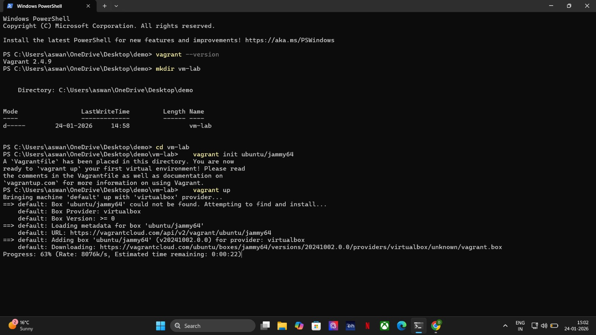

---

## Step 2: Initialize Ubuntu Box
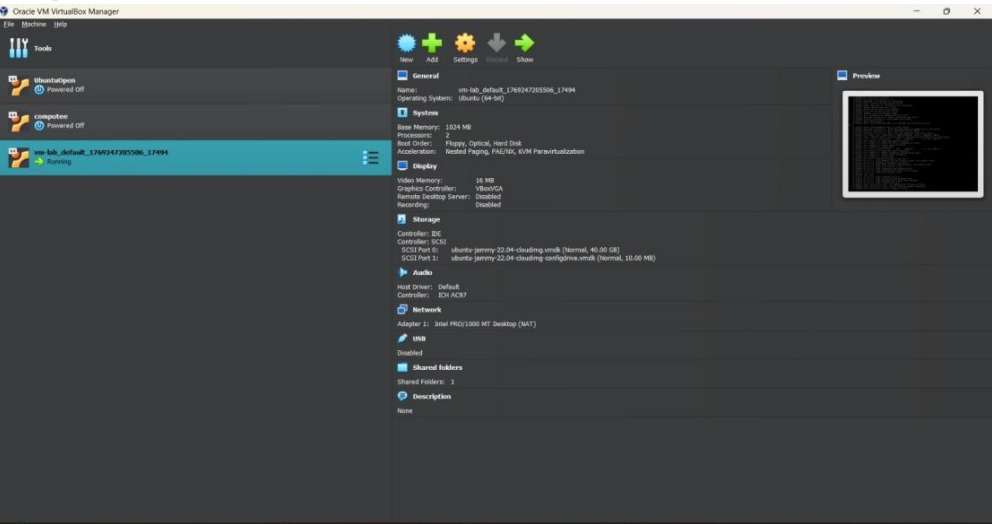

---

## Step 3: Start Virtual Machine
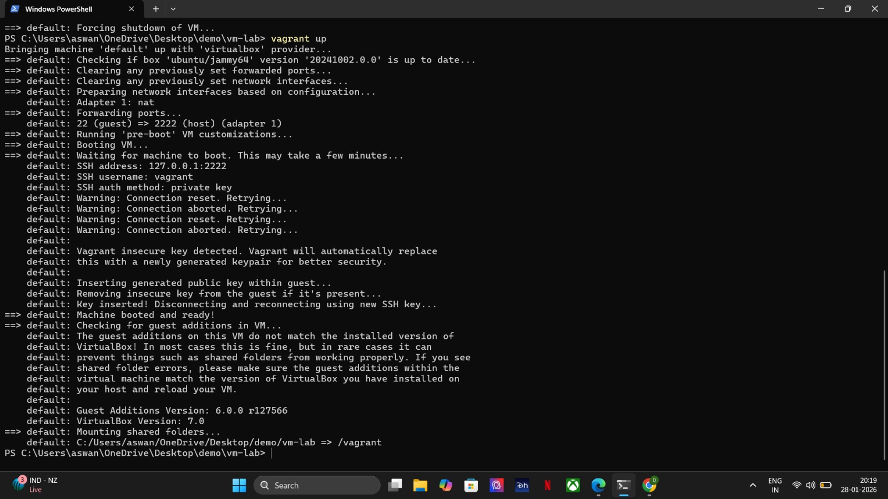

---

## Step 4: VM Visible in VirtualBox
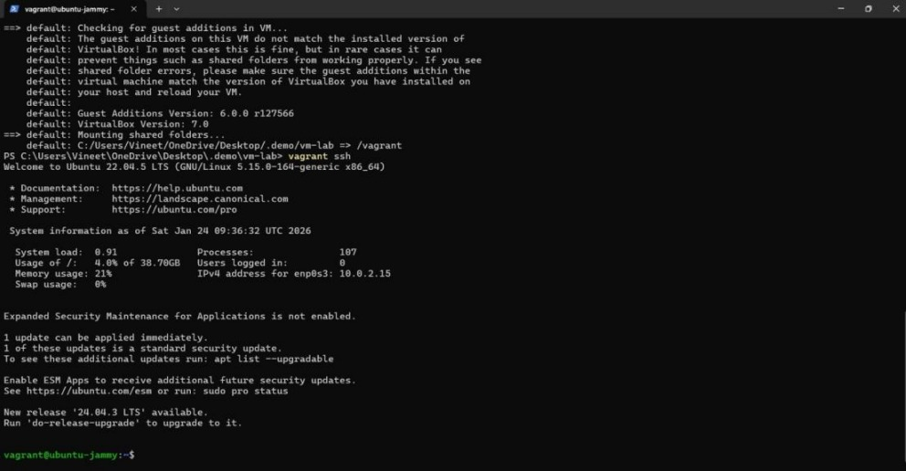

---

## Step 5: Login to Virtual Machine
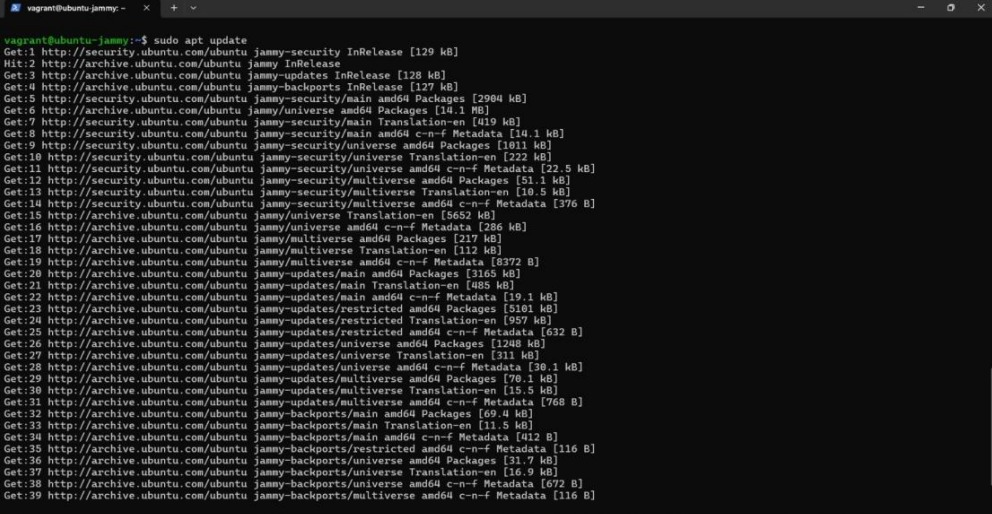

---

## Step 6: Update Ubuntu Packages
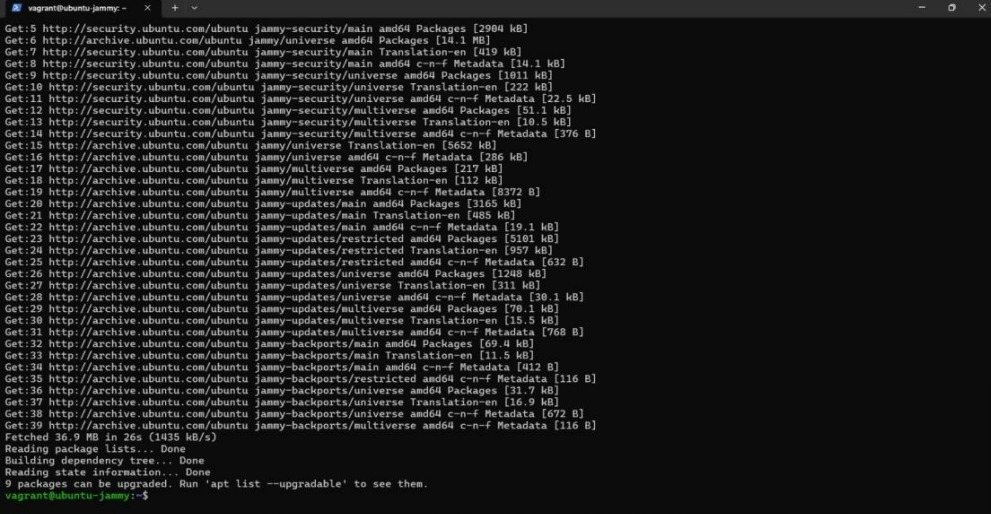

---

## Step 7: Install Nginx
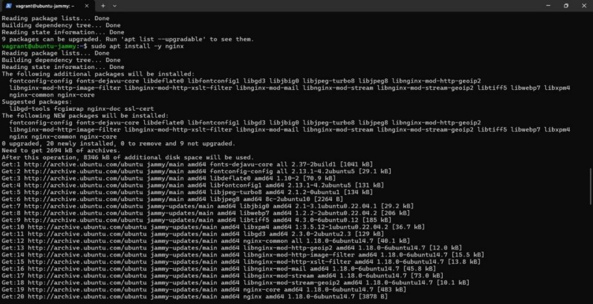

---

## Step 8: Nginx Installation Completed
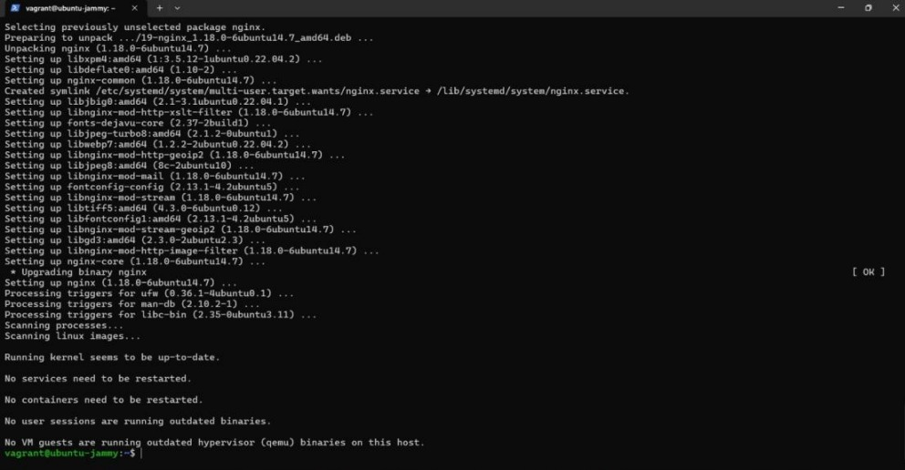

---

## Step 9: Verify Nginx using curl
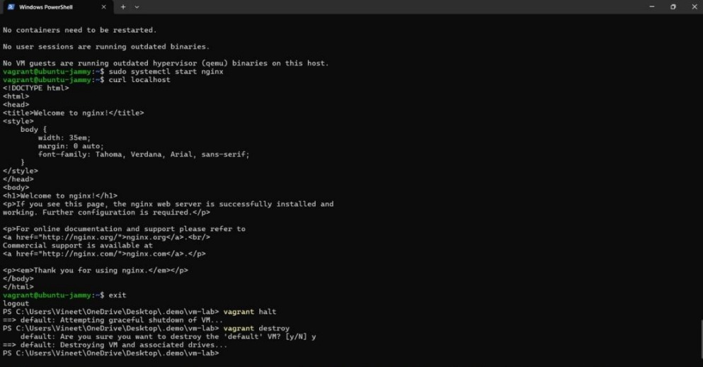

---

## Step 10: VM Resource Monitoring
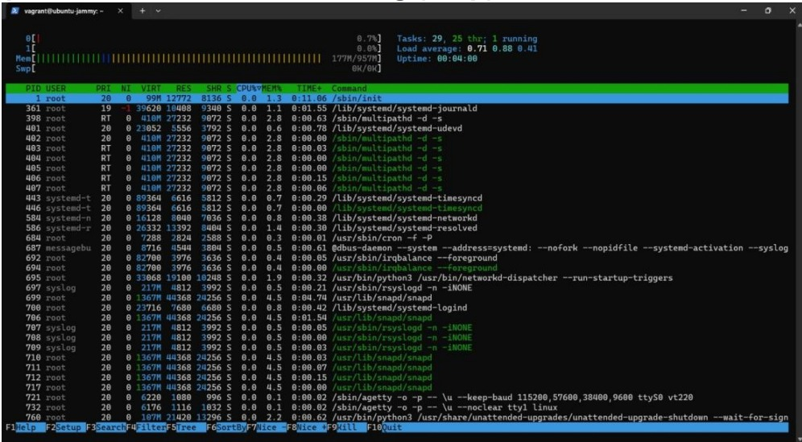

---

## Step 11: VM Memory & Boot Time
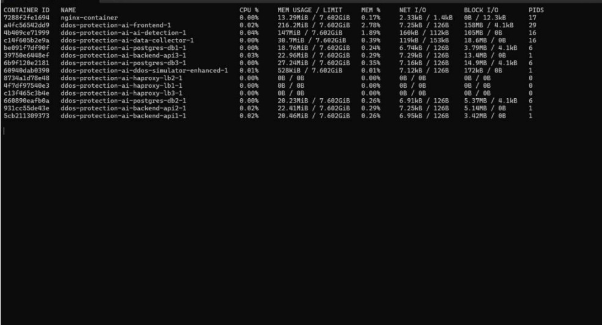

---

## Step 12: Container Resource Monitoring

---

## Result
Ubuntu VM and Nginx server were successfully deployed. Containers consume significantly fewer resources than Virtual Machines.

---

## Conclusion
Containers are lightweight and faster, while Virtual Machines provide stronger isolation.
