# Experiment 10: SonarQube – Static Code Analysis

---

## Theory

### Problem Statement

Code quality issues such as bugs, vulnerabilities, and code smells are often discovered late in the development cycle, making them expensive to fix. Manual code reviews are inconsistent and don't scale.

### What is SonarQube?

SonarQube is an open-source platform for **continuous inspection of code quality**. It performs automatic reviews with static analysis to detect bugs, code smells, and security vulnerabilities.

### How SonarQube Solves the Problem

- **Continuous Inspection** — Scans code with every commit, providing immediate feedback
- **Quality Gates** — Defines pass/fail criteria for code quality
- **Technical Debt Quantification** — Measures effort needed to fix issues
- **Multi-language Support** — Supports 20+ programming languages
- **Visual Analytics** — Dashboard showing code quality metrics and trends

### Key Concepts

| Term | Meaning |
|---|---|
| **Quality Gate** | Set of conditions code must meet before deployment |
| **Technical Debt** | Estimated time to fix all issues |
| **Code Smells** | Maintainability issues that don't affect functionality |
| **Vulnerabilities** | Security-related issues |
| **Bugs** | Code that might break or behave unexpectedly |
| **Coverage** | Percentage of code covered by tests |
| **Duplications** | Repeated code blocks |

---

## Lab Architecture

```
┌─────────────────┐     HTTP      ┌──────────────────┐
│  Developer      │──────────────▶│  SonarQube       │
│  Machine        │               │  Server          │
│  (WSL2)         │               │  (Container)     │
└─────────────────┘               └──────────────────┘
        │                                │
        ▼                                ▼
┌─────────────────┐               ┌──────────────────┐
│  Application    │               │  PostgreSQL      │
│  Source Code    │               │  Database        │
│  (Java)         │               │  (Container)     │
└─────────────────┘               └──────────────────┘
```

---

## Step 1: Setup SonarQube Environment

### Create Docker Network and Start PostgreSQL

```bash
docker network create sonarqube-lab

docker run -d \
  --name sonar-db \
  --network sonarqube-lab \
  -e POSTGRES_USER=sonar \
  -e POSTGRES_PASSWORD=sonar \
  -e POSTGRES_DB=sonarqube \
  -v sonar-db-data:/var/lib/postgresql/data \
  postgres:13
```

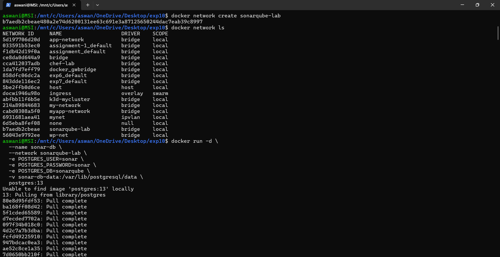

---

### Start SonarQube Server

```bash
docker run -d \
  --name sonarqube \
  --network sonarqube-lab \
  -p 9000:9000 \
  -e SONAR_JDBC_URL=jdbc:postgresql://sonar-db:5432/sonarqube \
  -e SONAR_JDBC_USERNAME=sonar \
  -e SONAR_JDBC_PASSWORD=sonar \
  -v sonar-data:/opt/sonarqube/data \
  -v sonar-extensions:/opt/sonarqube/extensions \
  sonarqube:lts-community

docker logs -f sonarqube
```

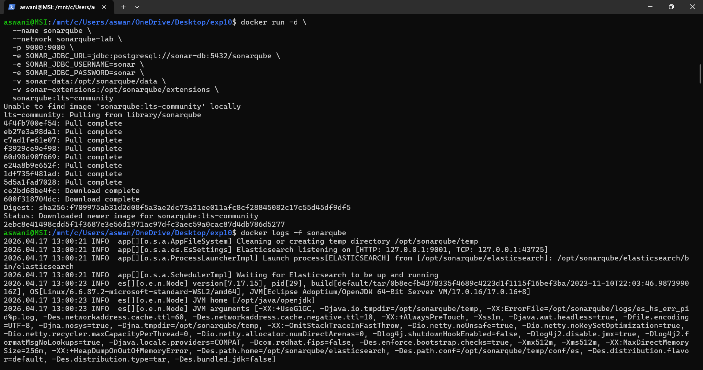

---

### Login to SonarQube

Access SonarQube at `http://localhost:9000`. Default credentials: `admin / admin`

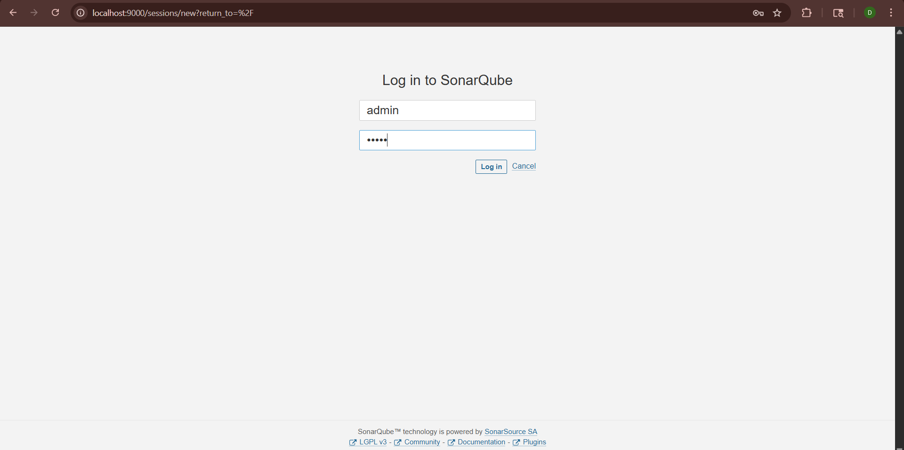

---

### Create Project

After login, select **Manually** to create a new project:

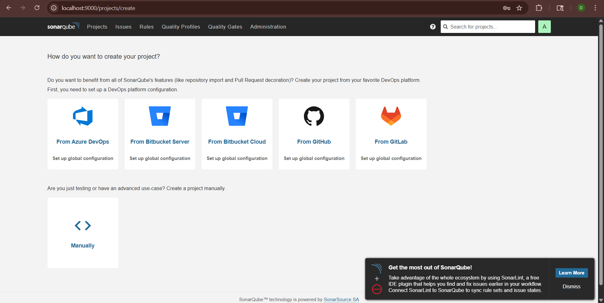

---

## Step 2: Install Java and Create Sample Application

### Install OpenJDK 17

```bash
sudo apt update
sudo apt install openjdk-17-jdk -y
```

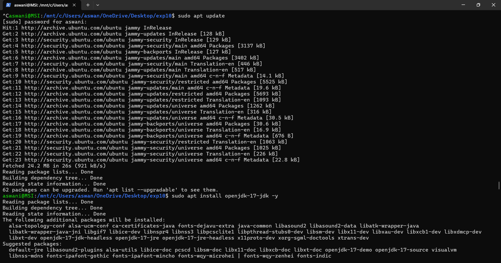

Verify installation:

```bash
javac -version
```

Output: `javac 17.0.18`

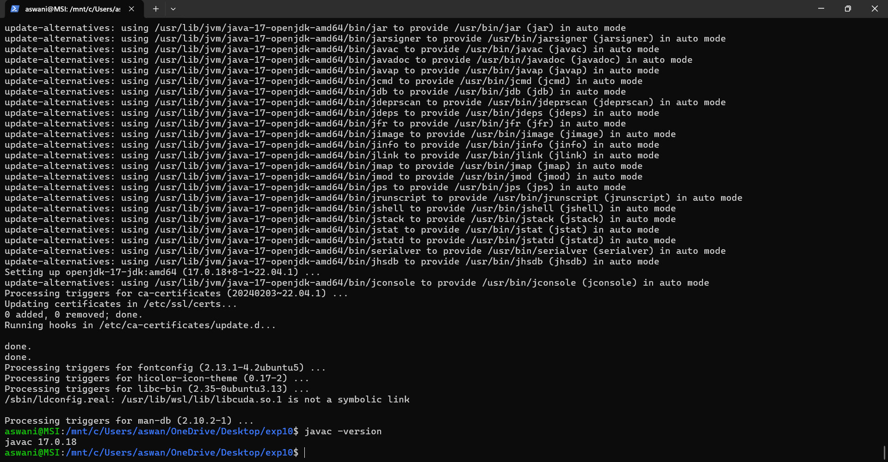

---

### Create Sample Java Application with Code Issues

```bash
mkdir -p sample-java-app/src/main/java/com/example

cat > sample-java-app/src/main/java/com/example/Calculator.java << 'EOF'
package com.example;

import java.util.ArrayList;
import java.util.List;

public class Calculator {

    // Bug: Division by zero not handled
    public int divide(int a, int b) {
        return a / b;  // Bug: Potential division by zero
    }

    // Code Smell: Unused variable
    public int add(int a, int b) {
        int result = a + b;
        int unused = 100;  // Code smell: Unused variable
        return result;
    }

    // Vulnerability: SQL injection risk
    public String getUser(String userId) {
        String query = "SELECT * FROM users WHERE id = " + userId;
        return query;
    }

    // Code Smell: Duplicate code
    public int multiply(int a, int b) {
        int result = 0;
        for (int i = 0; i < b; i++) {
            result = result + a;
        }
        return result;
    }

    // Duplicate code (same as multiply method)
    public int multiplyAlt(int a, int b) {
        int result = 0;
        for (int i = 0; i < b; i++) {
            result = result + a;
        }
        return result;
    }

    // Code Smell: Too many parameters
    public void processUser(String name, String email, String phone,
                           String address, String city, String state,
                           String zip, String country) {
        System.out.println("Processing: " + name);
    }

    // Bug: Null pointer risk
    public String getName(String name) {
        return name.toUpperCase();
    }

    // Code Smell: Empty catch block
    public void riskyOperation() {
        try {
            int x = 10 / 0;
        } catch (Exception e) {
            // Empty catch block
        }
    }
}
EOF
```

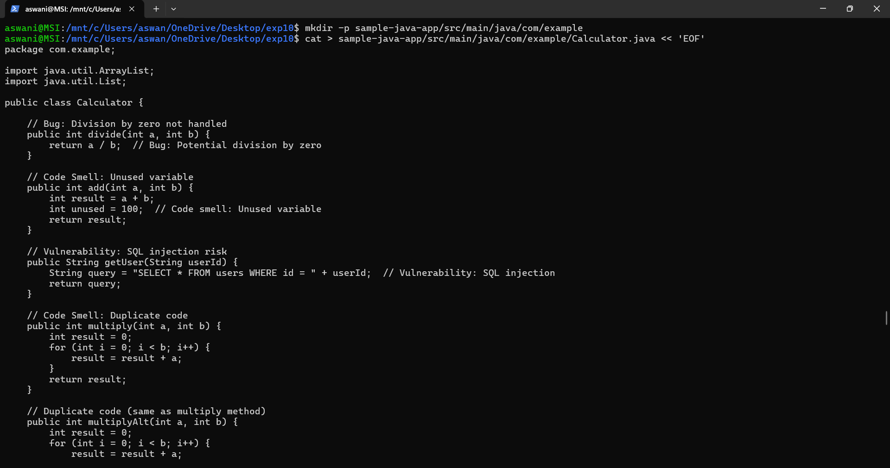

---

### Create pom.xml

```bash
cat > sample-java-app/pom.xml << 'EOF'
<?xml version="1.0" encoding="UTF-8"?>
<project xmlns="http://maven.apache.org/POM/4.0.0" ...>
    <modelVersion>4.0.0</modelVersion>
    <groupId>com.example</groupId>
    <artifactId>sample-app</artifactId>
    <version>1.0-SNAPSHOT</version>
    <properties>
        <maven.compiler.source>11</maven.compiler.source>
        <maven.compiler.target>11</maven.compiler.target>
        <sonar.projectKey>sample-java-app</sonar.projectKey>
        <sonar.host.url>http://localhost:9000</sonar.host.url>
    </properties>
</project>
EOF
```

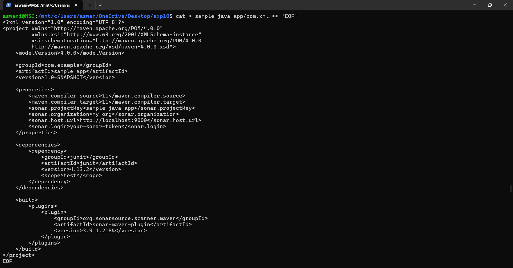

---

## Step 3: Install SonarQube Scanner

### Pull Scanner Docker Image and Download Local Scanner

```bash
docker run -d \
  --name sonar-scanner \
  --network sonarqube-lab \
  -v $(pwd)/sample-java-app:/usr/src \
  sonarsource/sonar-scanner-cli:latest \
  sleep infinity

wget https://binaries.sonarsource.com/Distribution/sonar-scanner-cli/sonar-scanner-cli-5.0.1.3006-linux.zip

sudo apt install unzip
```

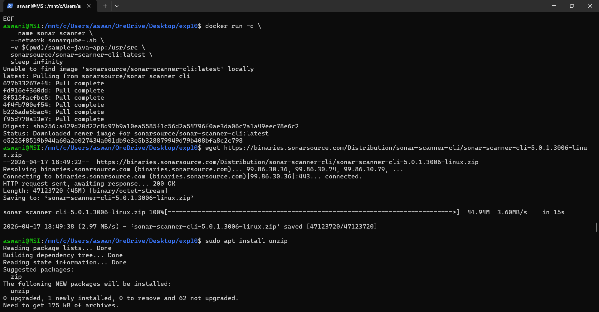

---

### Unzip Scanner

```bash
unzip sonar-scanner-cli-5.0.1.3006-linux.zip
```

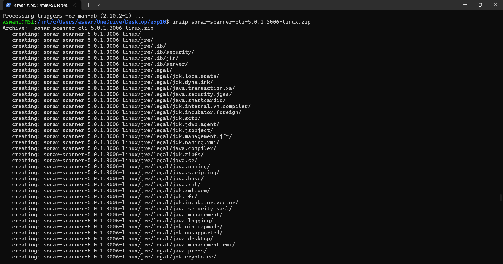

---

### Install and Verify Scanner

```bash
sudo mv sonar-scanner-5.0.1.3006-linux /opt/sonar-scanner
export PATH=$PATH:/opt/sonar-scanner/bin
sonar-scanner -v
```

Output: `SonarScanner 5.0.1.3006` running on `Java 17.0.7`

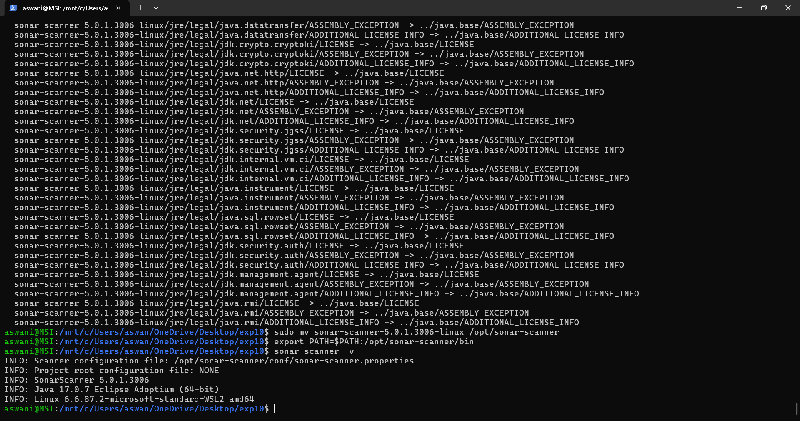

---

## Step 4: Generate SonarQube Token

In SonarQube:

```
Administrator → My Account → Security → Generate Token
```

- Token Name: `sonar-token`
- Type: User
- Expires: May 17, 2026
- Generated: `squ_95366d66485184044418ebe92296e3a3aebbec5d`

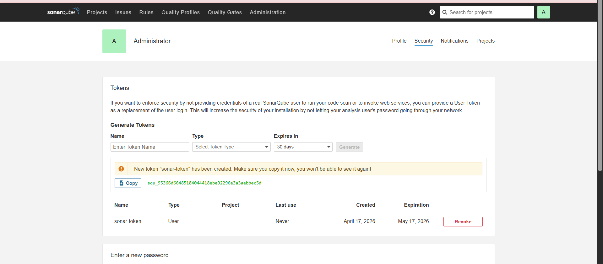

---

## Step 5: Configure and Run SonarQube Analysis

### Create sonar-project.properties

```bash
cat > sample-java-app/sonar-project.properties << 'EOF'
sonar.projectKey=sample-java-app
sonar.projectName=Sample Java Application
sonar.projectVersion=1.0
sonar.sources=src
sonar.java.binaries=target/classes
sonar.language=java
sonar.sourceEncoding=UTF-8
EOF
```

### Compile Java Source

```bash
cd sample-java-app
javac -d target/classes src/main/java/com/example/Calculator.java
```

### Run SonarQube Scan Using Local Scanner

```bash
sonar-scanner \
  -Dsonar.host.url=http://localhost:9000 \
  -Dsonar.login="squ_95366d66485184044418ebe92296e3a3aebbec5d"
```

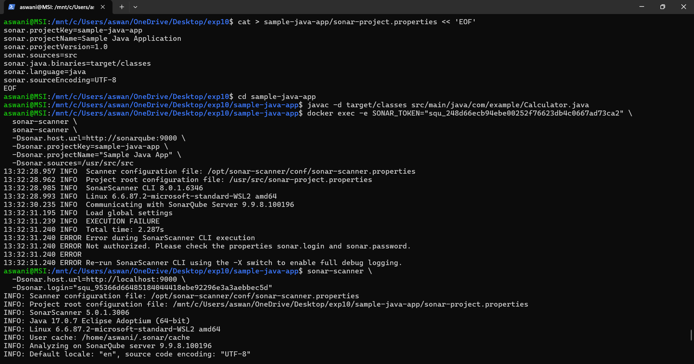

---

## Step 6: Analyze Results on SonarQube Dashboard

Open `http://localhost:9000/issues` to view the scan results.

**Results Summary:**

| Type | Count |
|---|---|
| Bugs | 1 |
| Vulnerabilities | 0 |
| Code Smells | 11 |
| **Total Issues** | **12** |
| **Technical Debt** | **1h 41min** |

**Issues detected in `Calculator.java`:**

- Remove unused import `java.util.ArrayList`
- Remove unused import `java.util.List`
- Remove useless assignment to local variable `unused`
- Remove unused local variable `unused`
- Immediately return expression instead of assigning to variable `query`
- Update `multiplyAlt` — identical implementation to `multiply` (duplicate code)
- Method has 8 parameters — greater than 7 authorized
- Remove unused method parameters (`email`, `phone`, `address`, `city`, `state`, `zip`, `country`)
- Replace `System.out` or `System.err` with a logger

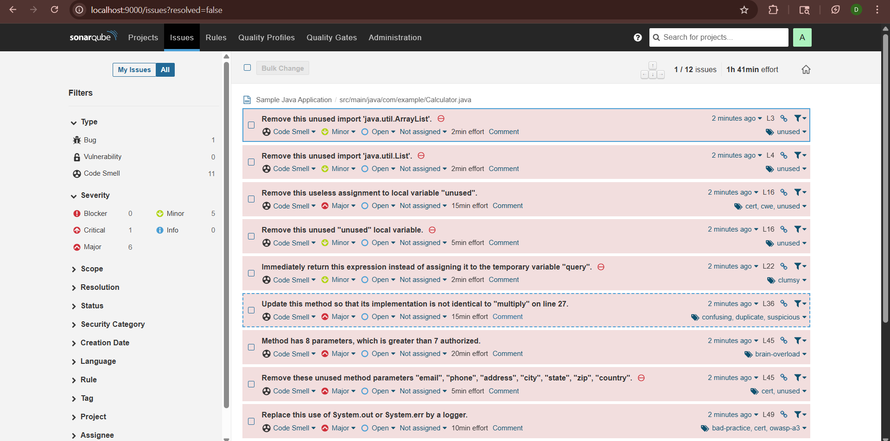

---

## Step 7: Fetch Issues via API

```bash
curl -u squ_95366d66485184044418ebe92296e3a3aebbec5d: \
  "http://localhost:9000/api/issues/search?projectKeys=sample-java-app"
```

Returns full JSON response with all 12 issues, their severity, effort, line numbers, and types:

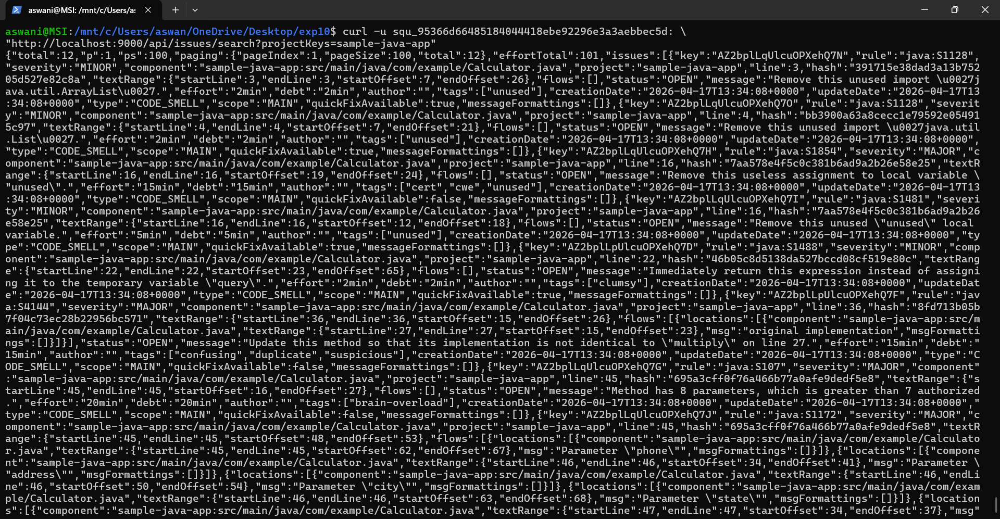

---

## Result

Successfully implemented SonarQube static code analysis:

- ✅ Created Docker network `sonarqube-lab` with PostgreSQL + SonarQube containers
- ✅ Accessed SonarQube at `localhost:9000` and logged in as admin
- ✅ Installed OpenJDK 17 (`javac 17.0.18`) and created `Calculator.java` with intentional issues
- ✅ Installed SonarScanner 5.0.1.3006 locally
- ✅ Generated SonarQube token (`sonar-token`)
- ✅ Ran scan — detected **12 issues** (1 Bug, 0 Vulnerabilities, 11 Code Smells)
- ✅ Technical Debt: **1h 41min**
- ✅ Fetched all issues via SonarQube REST API

---

## Conclusion

SonarQube provides powerful **automated static code analysis** that detects code quality issues early in the development cycle. By integrating SonarQube with Docker and running it against a sample Java application, this experiment demonstrated how bugs, code smells, and duplicate code can be automatically identified and quantified, enabling developers to maintain high code quality standards consistently.

---

## Comparative Summary

| Feature | Jenkins | Ansible | SonarQube |
|---|---|---|---|
| Primary Purpose | CI/CD Automation | Configuration Management | Code Quality Analysis |
| Architecture | Master-Agent | Push-based, Agentless | Client-Server |
| Language | Java, Groovy | Python, YAML | Java |
| Learning Curve | Moderate | Low | Low |
| Use Case | Build, Test, Deploy | Infrastructure as Code | Static Code Analysis |
