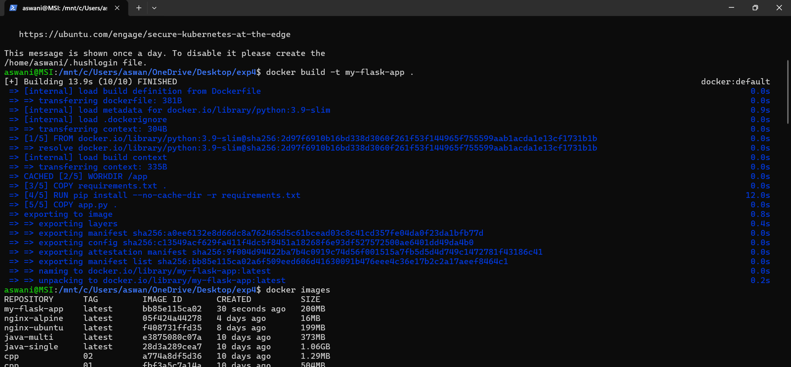
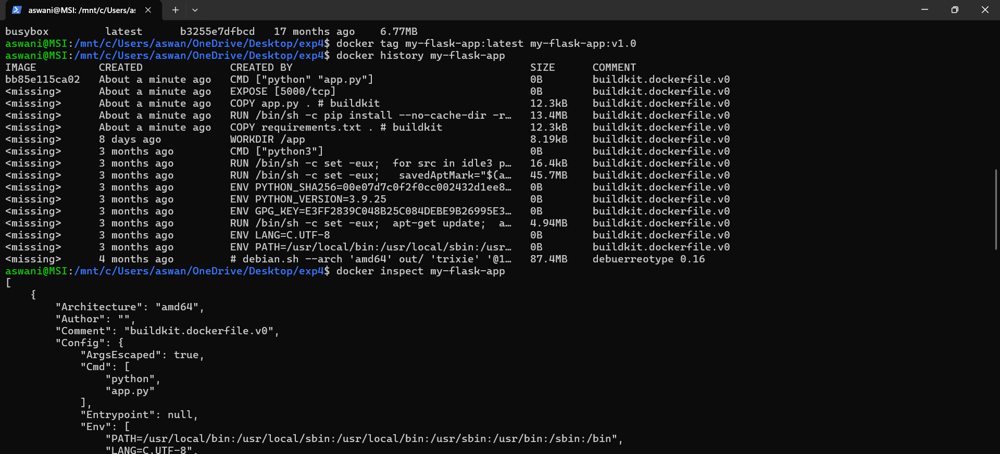
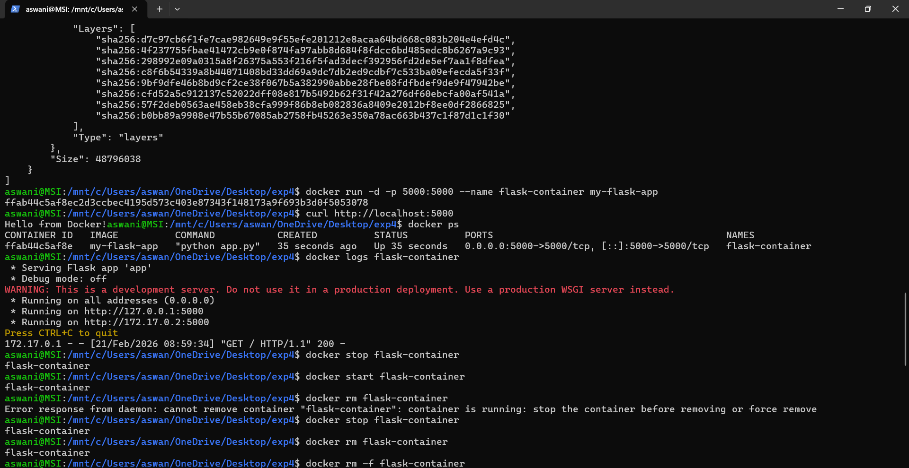
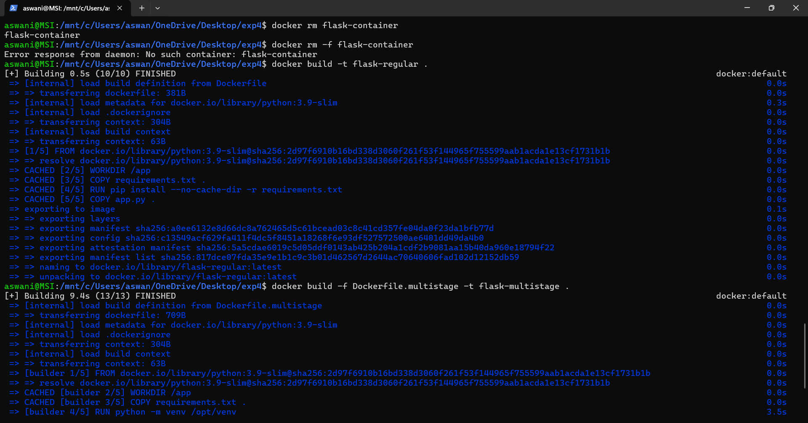
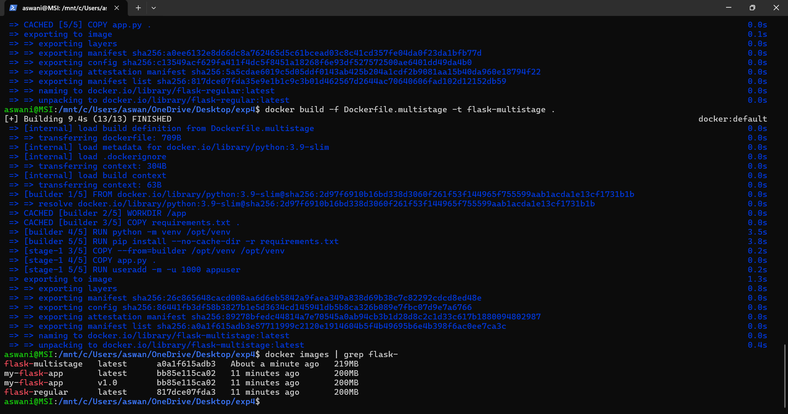
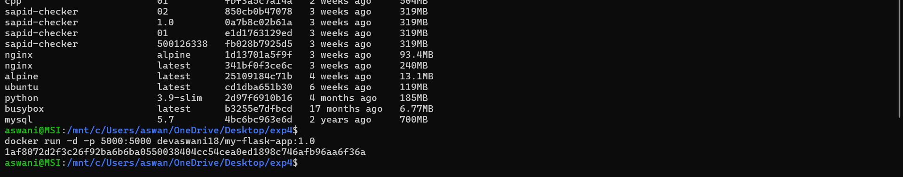
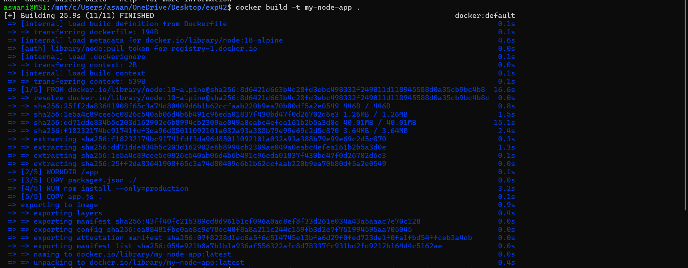
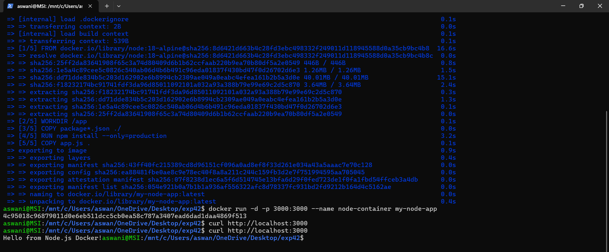

# 🧪 Experiment 4  
# Docker Essentials – Dockerfile, .dockerignore, Tagging & Publishing

---
# 🎯 Aim

To understand and implement core Docker concepts:

- Writing a Dockerfile  
- Using .dockerignore  
- Building and tagging Docker images  
- Running and managing containers  
- Multi-stage builds  
- Inspecting and analyzing images  

---

# 🧩 Part 1 – Containerizing a Python Flask Application

## 🔹 Application Code

**app.py**

```python
from flask import Flask
app = Flask(__name__)

@app.route('/')
def hello():
    return "Hello from Docker!"

@app.route('/health')
def health():
    return "OK"

if __name__ == '__main__':
    app.run(host='0.0.0.0', port=5000)
```

**requirements.txt**

```
Flask==2.3.3
```

---

## 🔹 Dockerfile

```dockerfile
FROM python:3.9-slim

WORKDIR /app

COPY requirements.txt .
RUN pip install --no-cache-dir -r requirements.txt

COPY app.py .

EXPOSE 5000

CMD ["python", "app.py"]
```

---

## 🔹 Build the Image

```bash
docker build -t my-flask-app .
```

 
Shows successful Docker image build process.

---

## 🔹 Run the Container

```bash
docker run -d -p 5000:5000 --name flask-container my-flask-app
```

## 🔹 Test Application

```bash
curl http://localhost:5000
```


Shows Flask app responding: **Hello from Docker!**

---

## 🔹 Check Running Containers

```bash
docker ps
```

 
Shows container running with port mapping 5000:5000.

---

## 🔹 View Logs

```bash
docker logs flask-container
```


Shows Flask server logs and successful request handling.

---

# 🧩 Part 2 – Using .dockerignore

## 🔹 .dockerignore File

```
__pycache__/
*.pyc
.env
.venv
.git/
.vscode/
logs/
```

### ✅ Purpose

- Reduces build context size  
- Improves build speed  
- Prevents sensitive files from entering image  
- Keeps image clean and secure  

(Verified during build process – unnecessary files were not copied.)

---

# 🧩 Part 3 – Image Tagging & Inspection

## 🔹 Tag Image

```bash
docker tag my-flask-app:latest my-flask-app:v1.0
```

---

## 🔹 View Image History

```bash
docker history my-flask-app
```

  
Shows Docker image layers and commands used to build image.

---

## 🔹 Inspect Image

```bash
docker inspect my-flask-app
```

  
Shows detailed JSON metadata of the Docker image.

---

# 🧩 Part 4 – Multi-Stage Build

## 🔹 Dockerfile.multistage

```dockerfile
# Stage 1 – Builder
FROM python:3.9-slim AS builder

WORKDIR /app
COPY requirements.txt .
RUN python -m venv /opt/venv
ENV PATH="/opt/venv/bin:$PATH"
RUN pip install --no-cache-dir -r requirements.txt

# Stage 2 – Runtime
FROM python:3.9-slim

WORKDIR /app
COPY --from=builder /opt/venv /opt/venv
ENV PATH="/opt/venv/bin:$PATH"

COPY app.py .

RUN useradd -m -u 1000 appuser
USER appuser

EXPOSE 5000
CMD ["python", "app.py"]
```

---

## 🔹 Build Multi-stage Image

```bash
docker build -f Dockerfile.multistage -t flask-multistage .
```

---

## 🔹 Compare Image Sizes

```bash
docker images | grep flask-
```

  
Shows comparison between regular image and multi-stage image.

✔ Multi-stage image is smaller  
✔ More secure (non-root user)  
✔ Optimized for production  

---

# 🧩 Part 5 – Container Management

## 🔹 Stop Container

```bash
docker stop flask-container
```

## 🔹 Remove Container

```bash
docker rm flask-container
```

 
Shows container stop and removal process.

---

# 🔑 Key Concepts Demonstrated

- Writing Dockerfile  
- Installing dependencies inside image  
- Port mapping (-p host:container)  
- Viewing logs and container status  
- Tagging images for versioning  
- Inspecting image metadata  
- Multi-stage builds for optimization  
- Running container as non-root user  

---

# 🏁 Result

Successfully:

- Containerized a Flask application  
- Built and tagged Docker images  
- Verified image layers and metadata  
- Implemented multi-stage build  
- Compared image sizes  
- Managed containers lifecycle  

Docker Essentials concepts were implemented and verified successfully.

---
