# 🧪 Experiment 6  
# Comparison of Docker Run vs Docker Compose | Multi-Stage Build | Networking

---

## 👨‍💻 Name: Dev Aswani  
## 📚 Subject: Docker & Containerization Lab  
## 🏫 Course: B.Tech CSE  

---

# 🎯 Aim

To study and implement:

- Docker container execution using `docker run`
- Multi-container orchestration using `docker compose`
- Docker networking
- Port mapping and environment variables
- WordPress + MySQL setup using Docker
- Multi-stage Docker builds
- Troubleshooting Docker errors

---

# 🧩 Part 1 – Running Nginx Using Docker Run

## 🔹 Command

```bash
docker run -d \
  --name my-nginx \
  -p 8080:80 \
  -v ./html:/usr/share/nginx/html \
  -e NGINX_HOST=localhost \
  --restart unless-stopped \
  nginx:alpine
```

## 🔹 Verify Container

```bash
docker ps
```

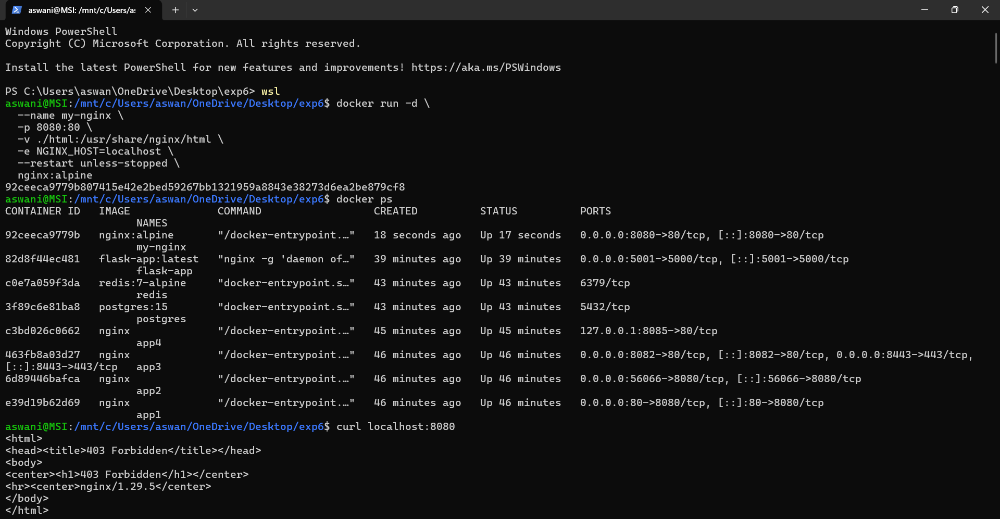
(Shows nginx container running on port 8080)

---

## 🔹 Test Using Curl

```bash
curl localhost:8080
```
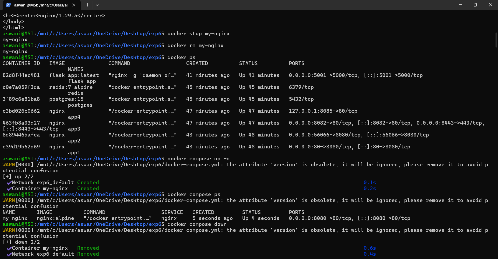
(Shows 403 Forbidden response from nginx)

---

## 🔹 Stop & Remove Container

```bash
docker stop my-nginx
docker rm my-nginx
```

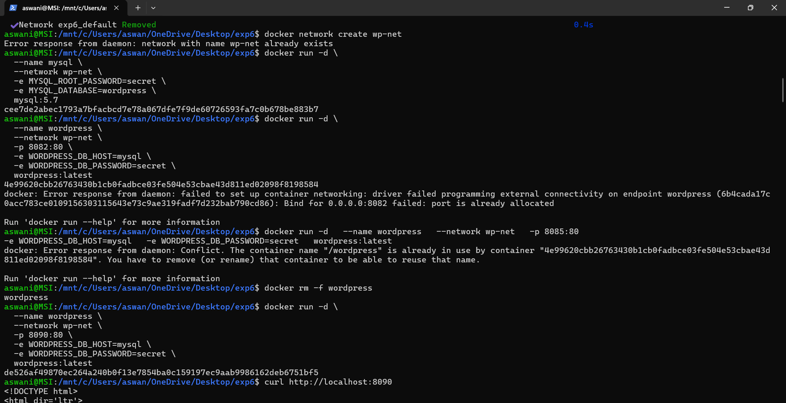
(Container stopped and removed successfully)

---

# 🧩 Part 2 – Using Docker Compose

## 🔹 docker-compose.yml

```yaml
services:
  nginx:
    image: nginx:alpine
    container_name: my-nginx
    ports:
      - "8080:80"
```

## 🔹 Run Compose

```bash
docker compose up -d
```

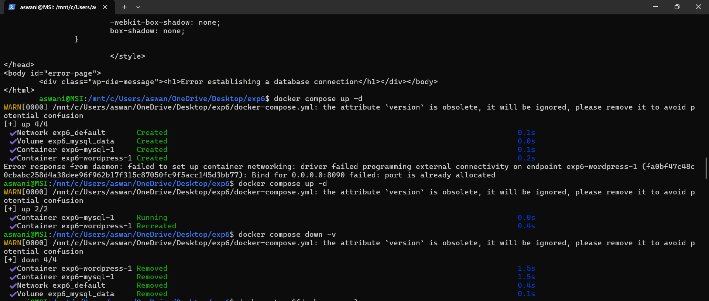
(Shows container and network creation via compose)

---

## 🔹 Stop Compose

```bash
docker compose down
```

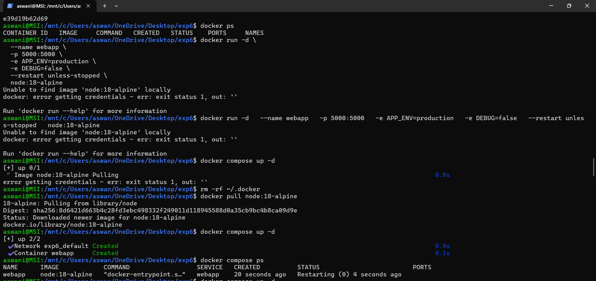
(Container and network removed successfully)

---

# 🧩 Part 3 – WordPress + MySQL Using Docker Network

## 🔹 Create Network

```bash
docker network create wp-net
```

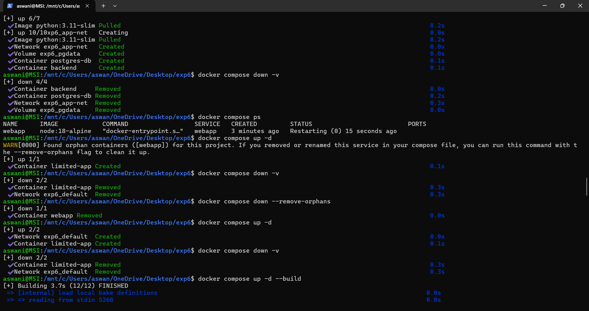 
(Network creation output)

---

## 🔹 Run MySQL Container

```bash
docker run -d \
  --name mysql \
  --network wp-net \
  -e MYSQL_ROOT_PASSWORD=secret \
  -e MYSQL_DATABASE=wordpress \
  mysql:5.7
```

---

## 🔹 Run WordPress Container

```bash
docker run -d \
  --name wordpress \
  --network wp-net \
  -p 8090:80 \
  -e WORDPRESS_DB_HOST=mysql \
  -e WORDPRESS_DB_PASSWORD=secret \
  wordpress:latest
```

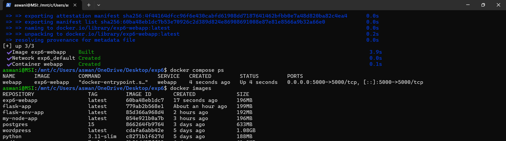  
(Shows port conflict and resolution)

---

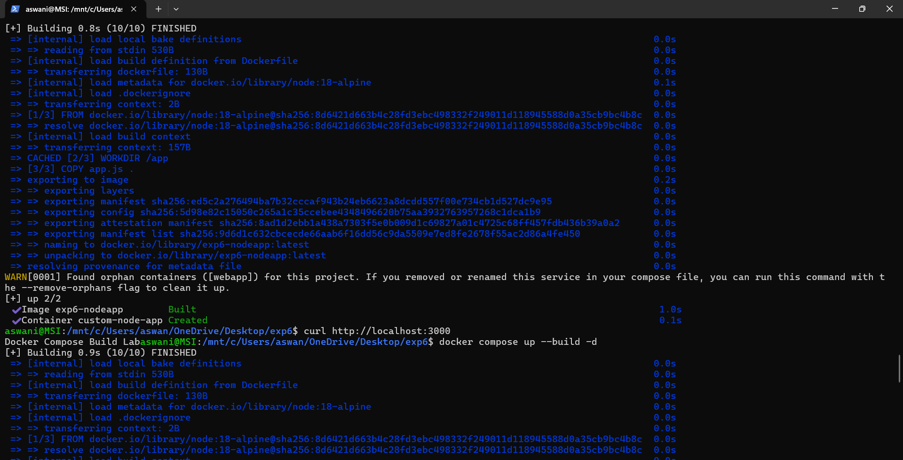
(Shows WordPress running on http://localhost:8090)

---

# 🧩 Part 4 – Multi-Stage Dockerfile (Advanced Node App)

## 🔹 Dockerfile

```dockerfile
# Stage 1 – Builder
FROM node:18-alpine AS builder

WORKDIR /app
COPY package*.json ./
RUN npm install --production
COPY . .

# Stage 2 – Production
FROM node:18-alpine

WORKDIR /app
COPY --from=builder /app /app

ENV PORT=3000
ENV APP_MODE=production

EXPOSE 3000

CMD ["node", "app.js"]
```

---

## 🔹 Build and Run Using Compose

```bash
docker compose up --build -d
```

---

## 🔹 Verify Application

```bash
curl localhost:3001
```

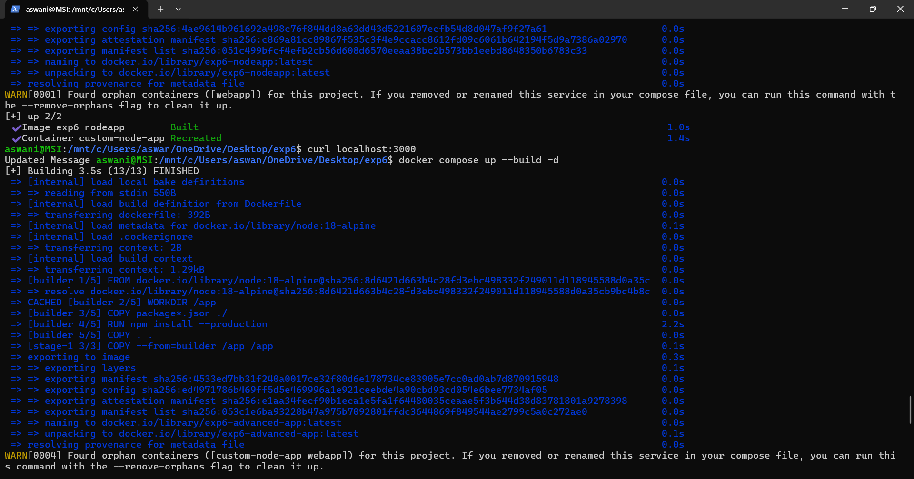  
(Shows advanced-node-app running in production mode)

---
### Multi-Stage Dockerfile with Compose
 - Requirement:
   - Create a simple Python FastAPI or Node production-ready app using:
      - Multi-stage Dockerfile
      - Smaller final image
      - Use Compose to build it
 - Must:
   - Write multi-stage Dockerfile
   - Use build: in Compose
   - Add environment variables
   - Add volume mount for development mode
   - Compare image size: `docker images`


- Build and Run :
  
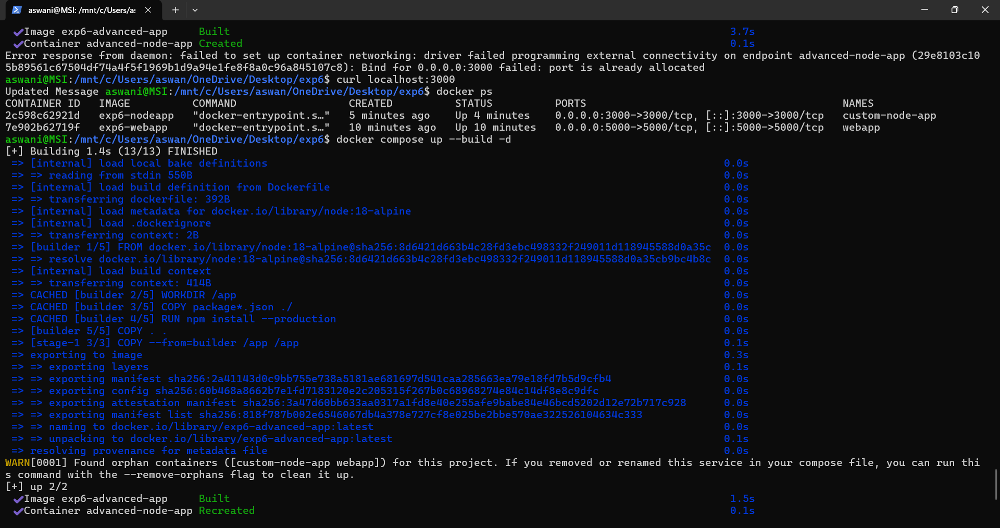

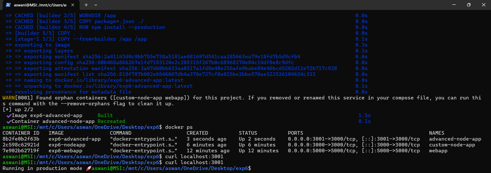
# 🧠 Difference Between Docker Run & Docker Compose

| Feature | Docker Run | Docker Compose |
|----------|------------|---------------|
| Configuration | CLI-based | YAML file |
| Multiple Containers | Manual | Automatic |
| Networking | Manual setup | Auto-created |
| Scalability | Difficult | Easy |
| Maintainability | Low | High |
| Production Ready | Limited | Yes |

---

# 🚀 Concepts Covered

- Containerization
- Port Mapping (`-p host:container`)
- Volume Mounting (`-v`)
- Environment Variables (`-e`)
- Docker Networks
- Restart Policies
- Orphan Containers
- Multi-stage Build Optimization
- Layer Caching

---

# ❗ Errors Faced & Solutions

### 1️⃣ Port Already Allocated
**Error:** Bind for 0.0.0.0 failed  
**Solution:** Stop existing container or change host port.

---

### 2️⃣ Container Name Conflict
**Error:** Container name already in use  
**Solution:** Remove existing container using:

```bash
docker rm -f <container-name>
```

---

### 3️⃣ Orphan Containers Warning
**Solution:**

```bash
docker compose down --remove-orphans
```

---

### 4️⃣ Database Connection Error (WordPress)
**Solution:** Ensure MySQL and WordPress are on same Docker network.

---

# 🏁 Result

Successfully implemented:

- Nginx container using Docker Run  
- Docker Compose orchestration  
- WordPress + MySQL networking  
- Multi-stage Node.js build  
- Port conflict resolution  
- Real-world Docker troubleshooting  

---

# 📌 Conclusion

This experiment provided hands-on experience in:

- Managing containers using CLI and Compose
- Building optimized Docker images
- Implementing multi-container architecture
- Handling production-level Docker errors
- Understanding networking and environment configurations

The practical exposure enhanced understanding of container orchestration and deployment workflows.

---
