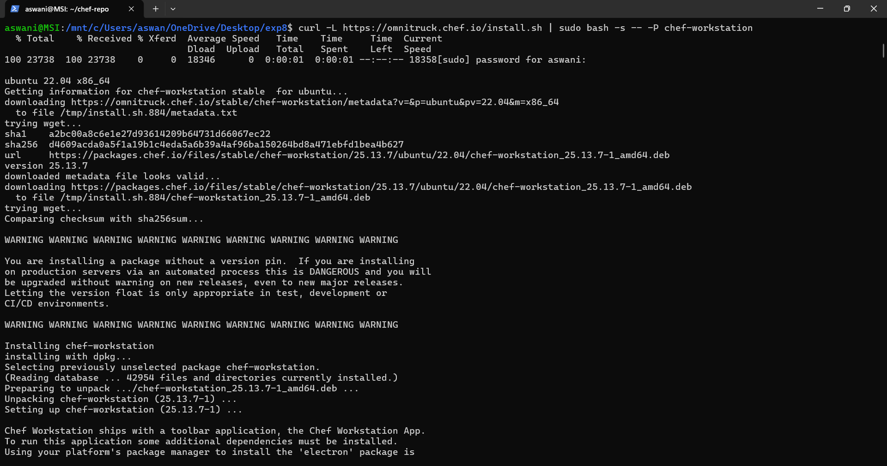
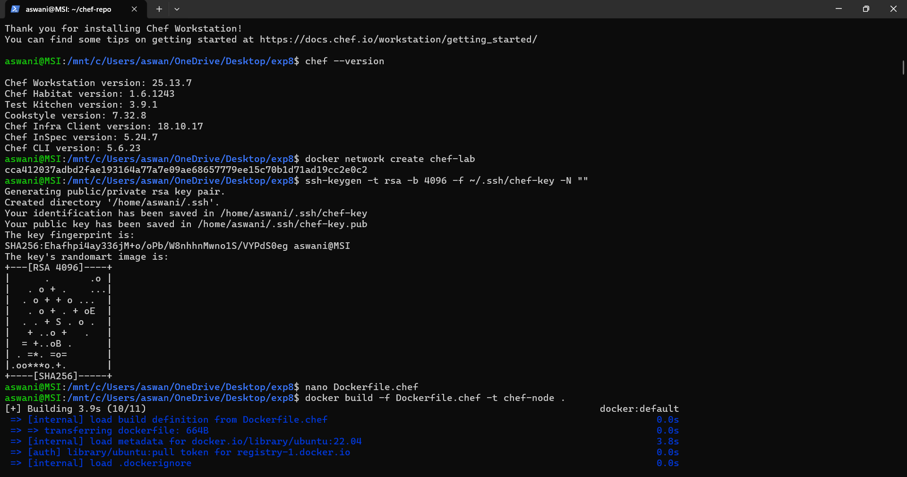
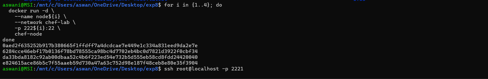
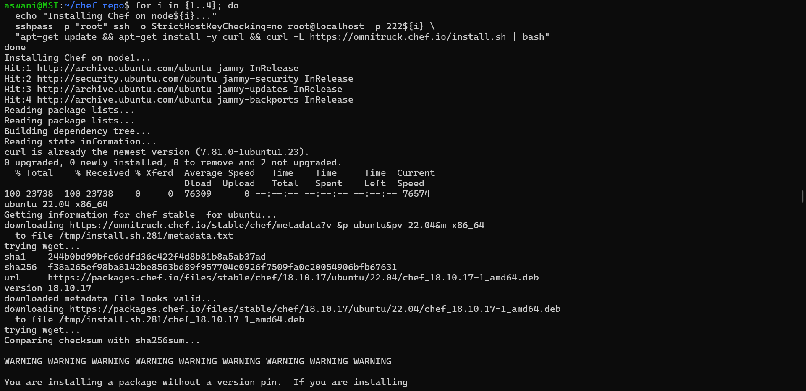
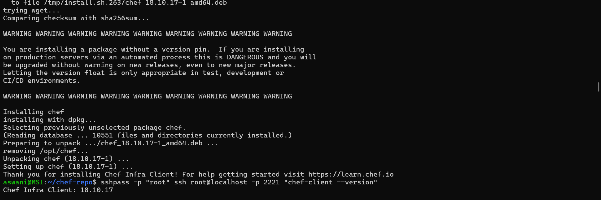
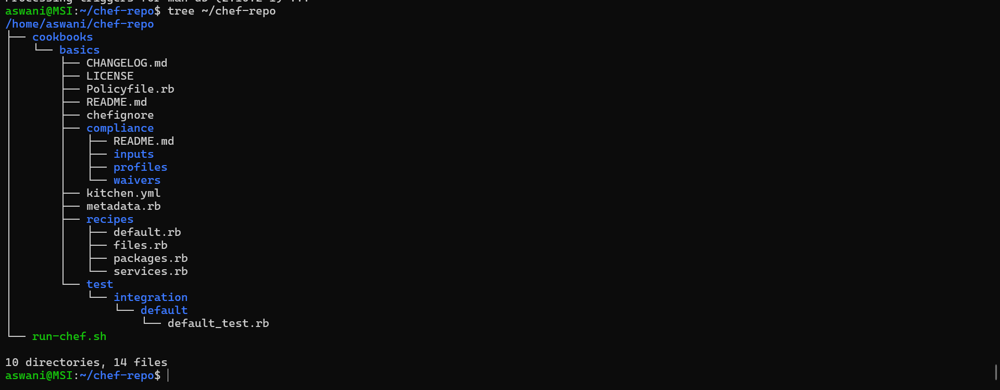
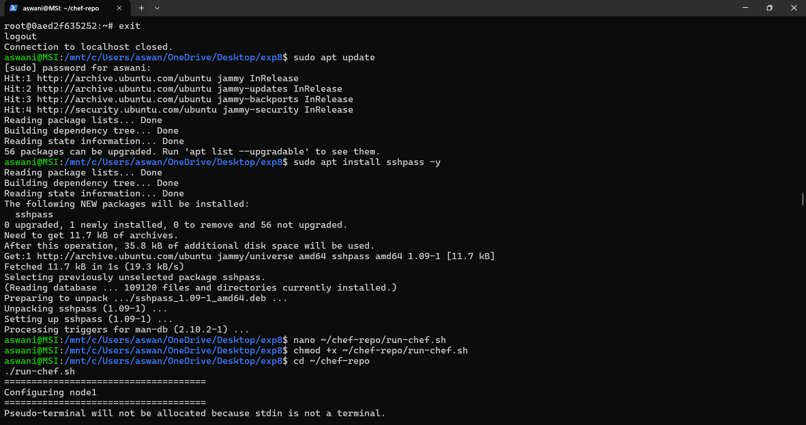
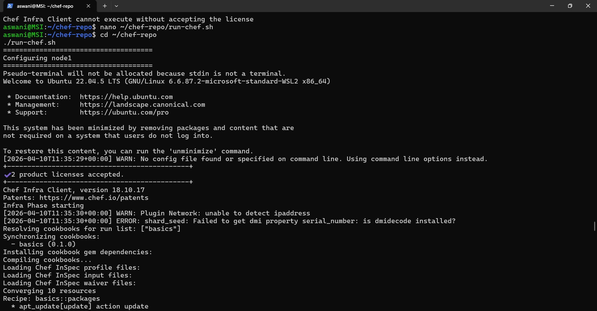
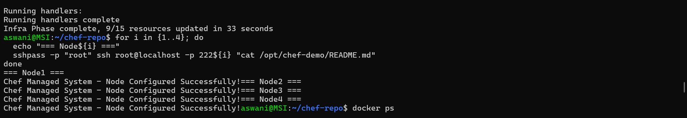
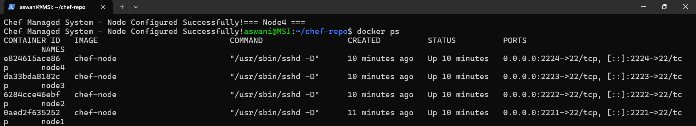

# Experiment 8: Chef – Configuration Management

---

## Problem Statement

Managing infrastructure manually across multiple servers leads to configuration drift, inconsistent environments, and time-consuming repetitive tasks. Chef offers a **pull-based** approach where nodes regularly check in with a central server, ensuring continuous compliance even when network connections are intermittent.

---

## What is Chef?

Chef is an **automation platform** that transforms infrastructure into code using a Ruby-based DSL (Domain Specific Language). It follows a **pull-based model** where agents (Chef clients) periodically pull configurations from a central Chef server.

> **Key Difference from Ansible:** Chef requires an agent installed on managed nodes, but offers more powerful dependency management and scales better for large enterprises.

### How Chef Solves the Problem

- **Pull-based Model** — Nodes check in with Chef server regularly, ensuring consistent state
- **Idempotent Resources** — Resources ensure desired state regardless of how many times applied
- **Infrastructure as Code** — All configurations version-controlled and testable
- **Community Cookbooks** — Reusable configurations for common applications

### Key Concepts

| Term | Meaning |
|---|---|
| **Chef Server** | Central repository for cookbooks, policies, and node data |
| **Chef Workstation** | Development machine where cookbooks are created and tested |
| **Chef Node** | Managed machine with Chef client installed |
| **Cookbook** | Collection of recipes, attributes, templates, and files |
| **Recipe** | Ruby-based file containing resource declarations |
| **Resource** | Building blocks (package, service, file, template, etc.) |
| **Run List** | Ordered list of recipes applied to a node |
| **Ohai** | System profiling tool that collects node attributes |

---

## Chef Architecture (Server-based)

```
┌─────────────────┐     HTTPS     ┌──────────────────┐
│  Chef           │──────────────▶│  Chef Server     │
│  Workstation    │  Upload(knife)│  (Port 443)      │
└─────────────────┘               └──────────────────┘
                                          │
                                          │ Pull (every 30 min)
                                          ▼
                                  ┌──────────────────┐
                                  │  Managed Nodes   │
                                  │  (Chef Client)   │
                                  └──────────────────┘
```

---

## Chef Solo vs Chef Server

| Aspect | Chef Solo | Chef Server |
|---|---|---|
| **Complexity** | Low | High |
| **Setup Time** | 15 minutes | 45+ minutes |
| **Server Required** | No | Yes |
| **Scalability** | Manual per node | Centralized |
| **Node Management** | Direct SSH | Chef Server API |
| **Search Capabilities** | No | Yes |
| **Best For** | Learning, small setups | Production, enterprises |

> **Note:** In this experiment, only **Chef Solo** is implemented practically since there is no official Chef Server Docker image available. Chef Server theory is covered above for understanding.

---

## Part A – Chef Solo (Practical Implementation)

### What is Chef Solo?

Chef Solo allows you to run Chef **without a central server**. Instead of nodes pulling from a server, you:
- Write cookbooks on your workstation
- Copy them to each node via SSH
- Run `chef-client --local-mode` on the node directly

It is simpler to set up and perfect for learning Chef concepts.

### Architecture (Chef Solo)

```
┌─────────────────────────────┐
│  Your Machine (Workstation) │
│  • Cookbooks                │
│  • Recipes                  │
│  • run-chef.sh script       │
└──────────────┬──────────────┘
               │  scp + ssh
               ▼
┌──────────────────────────────────────────┐
│  Docker Containers (Managed Nodes)       │
│  node1 (port 2221) | node2 (port 2222)  │
│  node3 (port 2223) | node4 (port 2224)  │
│                                          │
│  chef-client --local-mode                │
└──────────────────────────────────────────┘
```

---

## Step 1: Install Chef Workstation

Chef Workstation is installed on your control machine. It includes all Chef tools needed — `chef`, `knife`, `chef-client`, `cookstyle`, and more.

```bash
curl -L https://omnitruck.chef.io/install.sh | sudo bash -s -- -P chef-workstation
```



Verify installation:

```bash
chef --version
```

Output confirms:
- Chef Workstation version: **25.13.7**
- Chef Infra Client version: **18.10.17**
- Test Kitchen version: 3.9.1

---

## Step 2: Setup Lab Environment

### Create Docker Network and SSH Key

```bash
docker network create chef-lab

ssh-keygen -t rsa -b 4096 -f ~/.ssh/chef-key -N ""
```

### Create Dockerfile for Chef Nodes

```bash
nano Dockerfile.chef
```

```dockerfile
FROM ubuntu:22.04

RUN apt-get update && \
    apt-get install -y python3 openssh-server sudo curl && \
    apt-get clean

RUN mkdir -p /var/run/sshd && \
    echo 'root:root' | chpasswd && \
    sed -i 's/#PermitRootLogin prohibit-password/PermitRootLogin yes/' /etc/ssh/sshd_config && \
    sed -i 's/#PasswordAuthentication yes/PasswordAuthentication yes/' /etc/ssh/sshd_config

RUN mkdir -p /root/.ssh && chmod 700 /root/.ssh

EXPOSE 22
CMD ["/usr/sbin/sshd", "-D"]
```

### Build the Chef Node Image and Start 4 Containers

```bash
docker build -f Dockerfile.chef -t chef-node .

for i in {1..4}; do
  docker run -d \
    --name node${i} \
    --network chef-lab \
    -p 222${i}:22 \
    chef-node
done
```



All 4 containers started with their IDs returned:



---

## Step 3: Install Chef Client on All Nodes

Chef Client (the agent) must be installed on each managed node. We use `sshpass` to automate SSH commands across all nodes:

```bash
sudo apt install sshpass -y

for i in {1..4}; do
  echo "Installing Chef on node${i}..."
  sshpass -p "root" ssh -o StrictHostKeyChecking=no root@localhost -p 222${i} \
    "apt-get update && apt-get install -y curl && curl -L https://omnitruck.chef.io/install.sh | bash"
done
```



Chef Infra Client **18.10.17** installed successfully. Verify:

```bash
sshpass -p "root" ssh root@localhost -p 2221 "chef-client --version"
```

Output: `Chef Infra Client: 18.10.17`



---

## Step 4: Create the Cookbook

A **cookbook** is the fundamental unit of configuration in Chef. It contains recipes, templates, files, and metadata.

```bash
mkdir -p ~/chef-repo/cookbooks
cd ~/chef-repo

chef generate cookbook cookbooks/basics
```

### Cookbook Structure

```bash
tree ~/chef-repo
```



The generated structure shows:

```
~/chef-repo/
├── cookbooks/
│   └── basics/
│       ├── metadata.rb
│       ├── kitchen.yml
│       ├── recipes/
│       │   ├── default.rb
│       │   ├── packages.rb
│       │   ├── files.rb
│       │   └── services.rb
│       ├── compliance/
│       └── test/
└── run-chef.sh
```

### Create Recipes

**`default.rb`** — Main entry point that includes other recipes:

```ruby
include_recipe 'basics::packages'
include_recipe 'basics::files'
include_recipe 'basics::services'
```

**`packages.rb`** — Installs required packages:

```ruby
apt_update 'update' do
  action :update
  frequency 86400
end

%w(vim htop wget curl git).each do |pkg|
  package pkg do
    action :install
  end
end
```

**`files.rb`** — Creates directories and files on each node:

```ruby
directory '/opt/chef-demo' do
  owner 'root'
  group 'root'
  mode '0755'
  action :create
end

file '/opt/chef-demo/README.md' do
  content "Chef Managed System - Node Configured Successfully!"
  mode '0644'
  action :create
end
```

**`services.rb`** — Ensures SSH service is running:

```ruby
service 'ssh' do
  action [:enable, :start]
end
```

---

## Step 5: Create the Run Script

Since we're using Chef Solo (no server), we write a script that copies cookbooks to each node via `scp` and runs `chef-client --local-mode` on each:

```bash
nano ~/chef-repo/run-chef.sh
chmod +x ~/chef-repo/run-chef.sh
```

```bash
#!/bin/bash
for i in {1..4}; do
  echo "================================="
  echo "Configuring node${i}"
  echo "================================="

  sshpass -p "root" ssh -o StrictHostKeyChecking=no root@localhost -p 222${i} "mkdir -p /opt/chef"
  sshpass -p "root" scp -P 222${i} -r ~/chef-repo/cookbooks root@localhost:/opt/chef/

  sshpass -p "root" ssh -p 222${i} root@localhost \
    "cd /opt/chef && chef-client --local-mode --runlist 'recipe[basics]'"

  echo "Node${i} configured successfully"
done
```

---

## Step 6: Run Chef Solo

```bash
cd ~/chef-repo
./run-chef.sh
```

Chef runs on each node, converging resources:



Chef Infra Client starts, accepts licenses, resolves the `basics (0.1.0)` cookbook, and converges **10 resources** across recipes (packages, files, services):



**Infra Phase complete — 9/15 resources updated in 33 seconds**

---

## Step 7: Verify Configuration

Check that the file was created on all 4 nodes:

```bash
for i in {1..4}; do
  echo "=== Node${i} ==="
  sshpass -p "root" ssh root@localhost -p 222${i} "cat /opt/chef-demo/README.md"
done
```

All 4 nodes output: **"Chef Managed System – Node Configured Successfully!"**



Verify all containers are still running:

```bash
docker ps
```



All 4 containers (`node1`–`node4`) running on ports 2221–2224.

---

## Part B – Chef Server (Theory Only)

> **Note:** Chef Server is not implemented practically in this experiment as there is no official Chef Server Docker image available for easy deployment. The following is provided for theoretical understanding only.

### What is Chef Server?

Chef Server acts as a **central hub** for your infrastructure:
- Stores all cookbooks, roles, environments and node data
- Nodes (with Chef Client installed) **pull** their configuration from the server every 30 minutes
- Provides search, authentication, and authorization

### Chef Server Architecture

```
Workstation ──(knife upload)──▶ Chef Server ──(pull every 30m)──▶ Managed Nodes
```

### Key Chef Server Components

- **knife** — CLI tool used to interact with Chef Server (upload cookbooks, bootstrap nodes)
- **Validator Key** — Used to register new nodes with the server
- **Berkshelf** — Dependency manager for cookbooks (like npm for Node.js)
- **Bootstrap** — Process of installing Chef Client + registering a node with the server

### Chef Server Commands (Reference)

```bash
# Upload cookbook to server
knife cookbook upload basics

# List all registered nodes
knife node list

# Bootstrap a new node
knife bootstrap localhost --ssh-user root --node-name node1 --run-list 'recipe[basics]'

# View node details
knife node show node1

# SSH into all nodes
knife ssh "name:node*" "chef-client" --ssh-user root
```

---

## Chef vs Ansible Comparison

| Feature | Chef | Ansible |
|---|---|---|
| **Architecture** | Pull-based (agent required) | Push-based (agentless) |
| **Language** | Ruby DSL | YAML |
| **Learning Curve** | Steep | Gentle |
| **Setup Complexity** | High | Low |
| **Idempotency** | Yes | Yes |
| **Real-time Changes** | Delayed (pull interval) | Immediate (push) |
| **Scaling** | Excellent (5000+ nodes) | Good (up to 2000 nodes) |
| **Best For** | Large enterprises | Small to medium, cloud |

---

## Result

Successfully implemented Chef Solo configuration management:

- ✅ Installed Chef Workstation **v25.13.7** on control machine
- ✅ Created Docker network `chef-lab` and SSH key pair (`chef-key`)
- ✅ Built `chef-node` Docker image and started 4 containers (node1–node4) on ports 2221–2224
- ✅ Installed Chef Infra Client **18.10.17** on all 4 nodes
- ✅ Created `basics` cookbook with 4 recipes (default, packages, files, services)
- ✅ Ran `./run-chef.sh` — Chef converged **9/15 resources in 33 seconds** per node
- ✅ Verified `/opt/chef-demo/README.md` on all 4 nodes: **"Chef Managed System – Node Configured Successfully!"**

---

## Conclusion

Chef Solo provides a practical way to learn Chef's core concepts — cookbooks, recipes, and resources — without the complexity of setting up a Chef Server. By using Docker containers as managed nodes, we demonstrated how Chef can automate configuration tasks across multiple servers consistently and idempotently. The same cookbook applied multiple times always produces the same result, which is the core principle of infrastructure as code.
