# Docker & Containerization – Theory

## Before 27th january
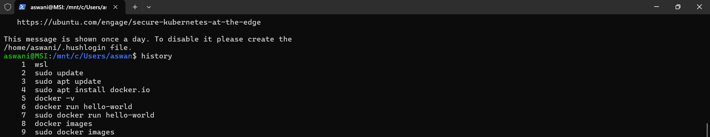
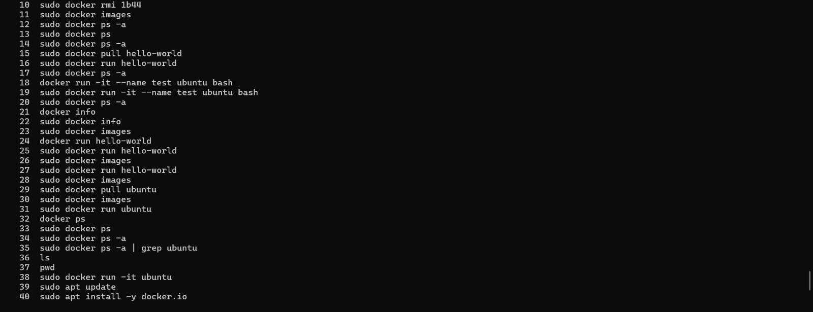
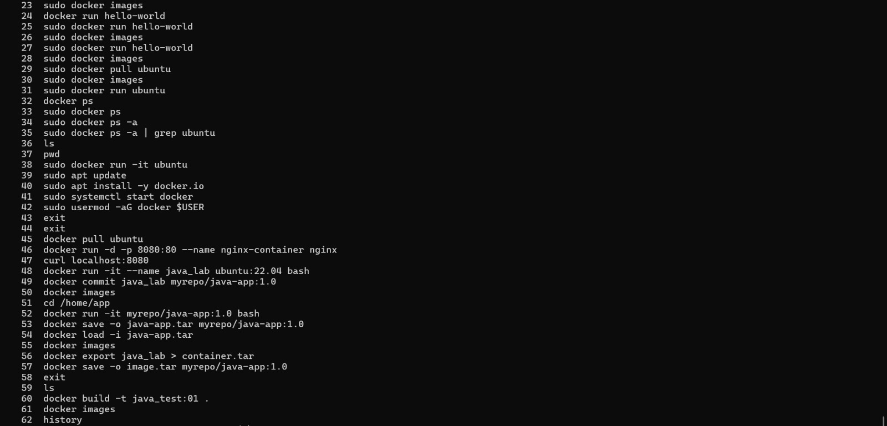

## 27th and 28th January

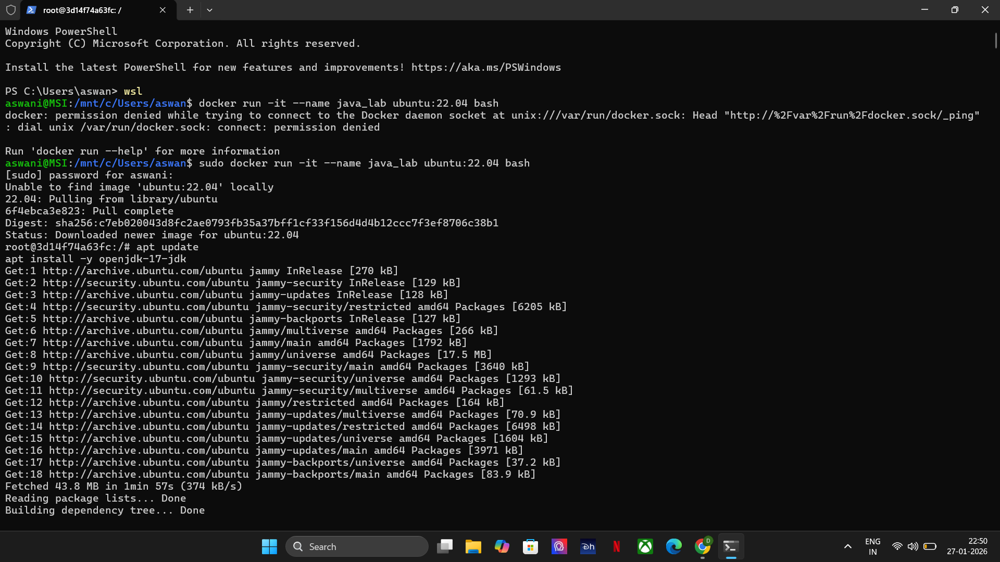
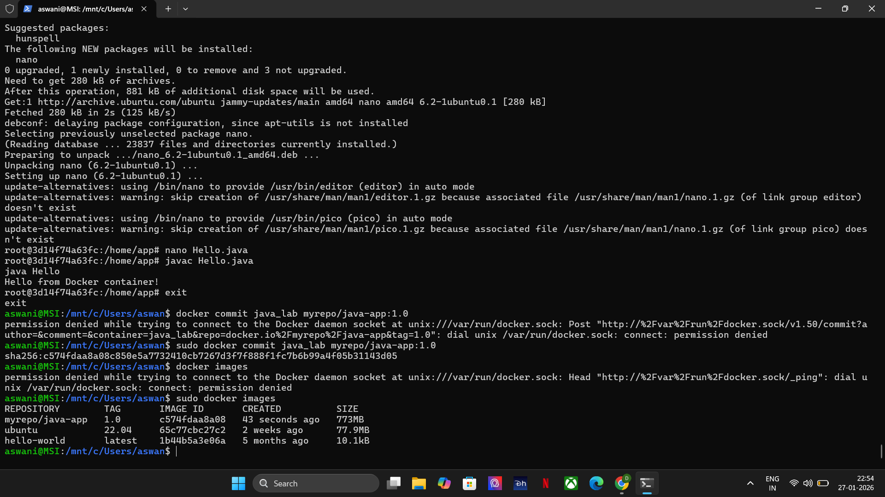
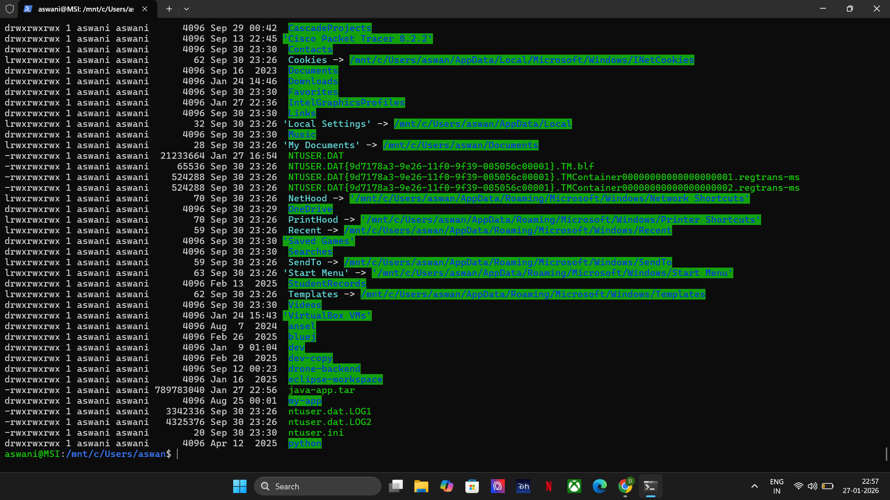
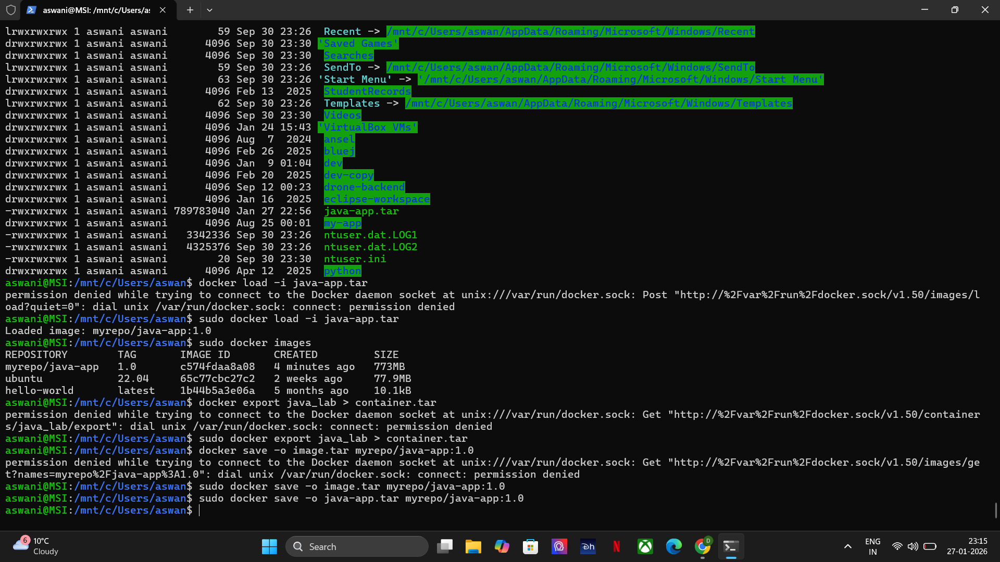
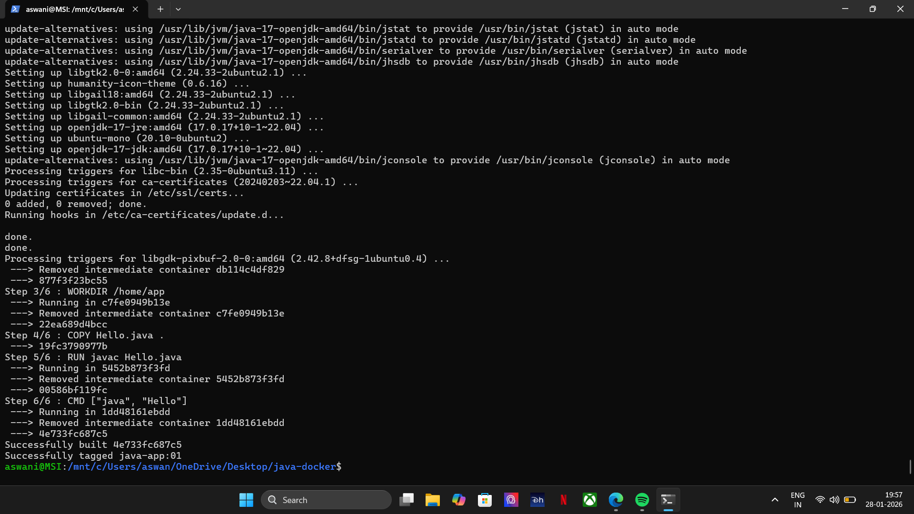
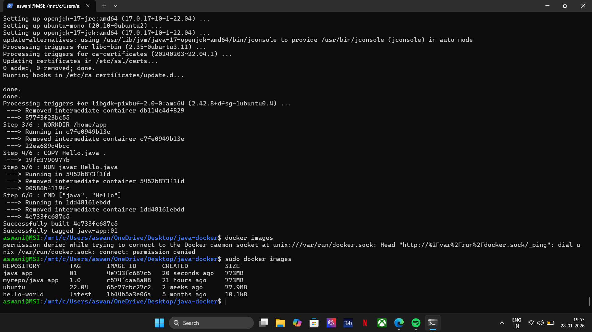

# 29th january
- practiced Markdown syntax for documentation using online tutorial.
- created headings, subheadings, bold and italic text.
- created ordered and unordered lists.
- inserted links and images using markdown format.
- practiced writing code blocks and inline code.
- learned how to structure README files properly.

Reference:
https://www.markdowntutorial.com/

# 30th january

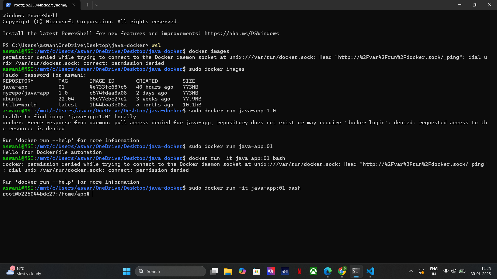
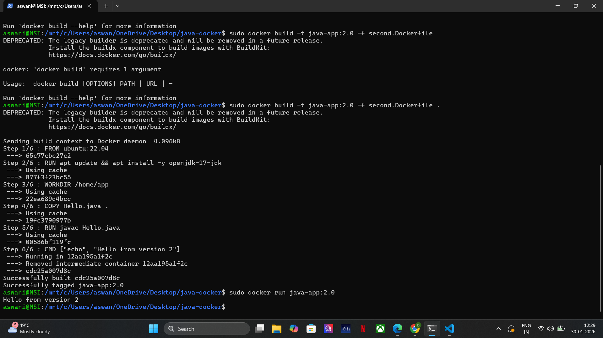
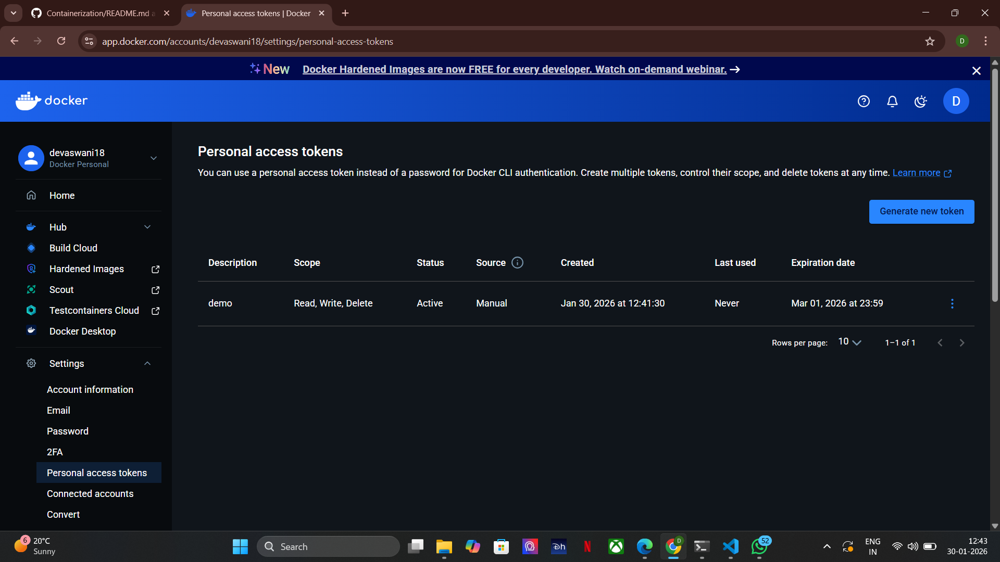
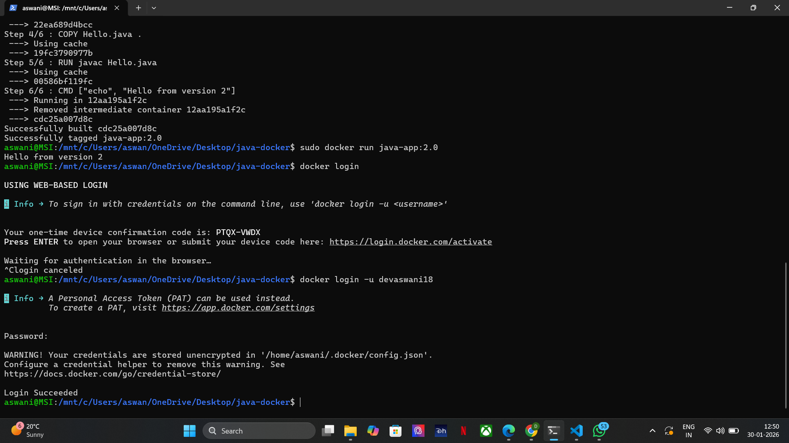
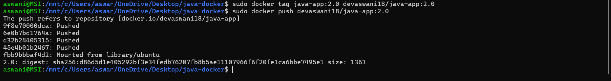
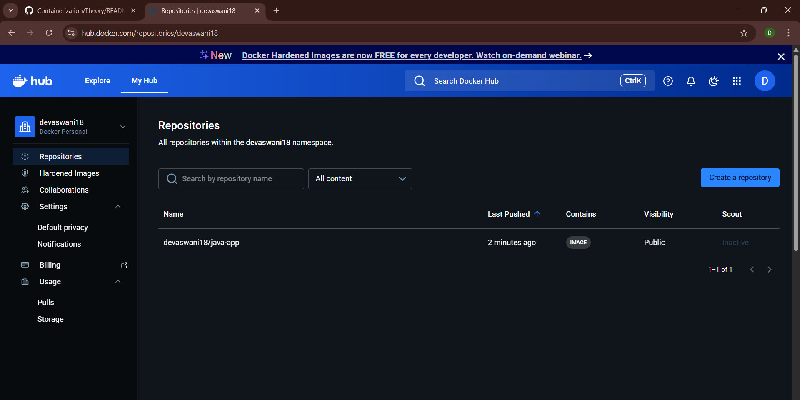

# 3rd february

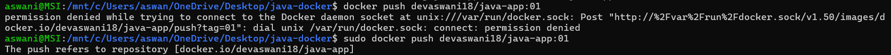
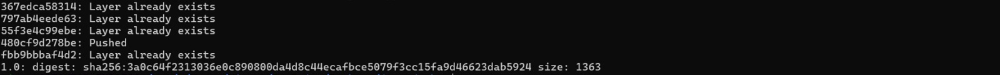

---

